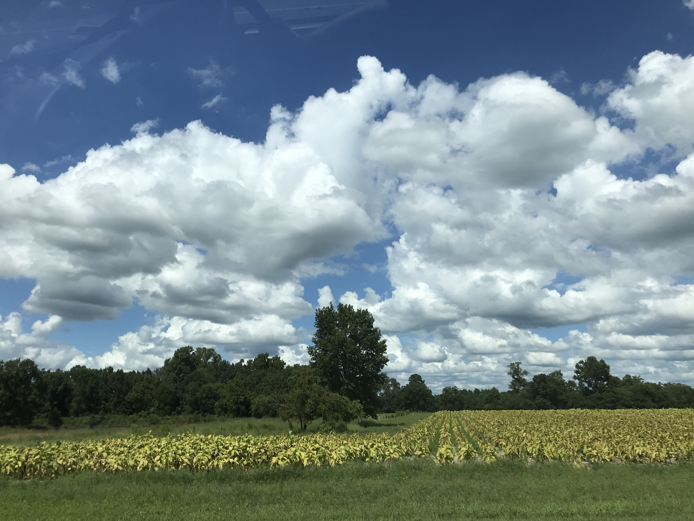

---
output:
  html_document:
    fig_width: 9
    toc: yes
    toc_float: yes
---

```{r, echo=FALSE}
tutblog <- read.csv("research_tutblogs.csv", encoding = "UTF-8")
selection<-tutblog[tutblog$name=="Field visit at Claridge",]
```
`r paste0("# ",selection$name)`
`r paste0("### *by ",selection$authors,"*")`

<div class = "row">
<div class = "col-md-9">`r paste0("*started ",selection$date," and updated ",format(Sys.Date(), '%Y-%m-%d'),"*")`</div>

<br/>

```{r echo=FALSE, message=FALSE, out.width="80%", fig.align='center'}
library(knitr)

```

----------

# Introduction
For claridge project, we usually go there biweekly to do a manual service/maintenance. There are several reasons: 1) we used isco sampler to automatically collect water samples every 14 hours, but We need to replace full bottles with empty ones after two weeks. 2) download data because S::CAN and sontek data can only be stored within a short period of time. 3) check solar and marine battery. 4) manually clean Manta, Sontek, and S::CAN probe lenser. 5) take grab samples back to the lab for detecting if there is any difference between samples measured immediately and samples measured after two weeks. 6) take muanal flow measurement 7) download Manta data 8) clean the flume and stream, sometimes there will be plenty of trims/algae in streams 9) cut the grass because summer is coming. 10) grab tributary samples back to the lab. 11) finally check everything works all right, then you are good to go. 

In this part, i will mainly record some interesting stories i have seen (some are research-related, some are not) during each field visit. Go Pack, Go Field!

Based on summary of the laboratory analyses for discrete samples in Chiao-Wen's dissertation, there is a general range for water quality parameters.

* CLUP
  - Nitrate-nitrogen: 2.98 $\pm$ 0.61
  - Ammonium-nitrogen: 0.19 $\pm$ 0.16
  - TDN: 3.50 $\pm$ 0.63
  - TKN: 0.61 $\pm$ 0.29
  - DOC: 5.03 $\pm$ 1.60
  - TP: 0.09 $\pm$ 0.15
  - Phosphate-Phosphorus: 0.02 $\pm$ 0.03
  - TSS: 16.46 $\pm$ 32.74
* CLMD
  - Nitrate-nitrogen: 2.69 $\pm$ 0.59
  - Ammonium-nitrogen: 0.14 $\pm$ 0.06
  - TDN: 3.16 $\pm$ 0.54
  - TKN: 0.65 $\pm$ 0.25
  - DOC: 6.10 $\pm$ 2.12
  - TP: 0.08 $\pm$ 0.05
  - Phosphate-Phosphorus: 0.01 $\pm$ 0.02
  - TSS: 21.51 $\pm$ 31.47
* CLDN
  - Nitrate-nitrogen: 2.41 $\pm$ 0.50
  - Ammonium-nitrogen: 0.20 $\pm$ 0.12
  - TDN: 2.96 $\pm$ 0.52
  - TKN: 0.71 $\pm$ 0.27
  - DOC: 6.14 $\pm$ 1.88
  - TP: 0.11 $\pm$ 0.10
  - Phosphate-Phosphorus: 0.02 $\pm$ 0.01
  - TSS: 23.74 $\pm$ 29.70

**Note: The detection limit is 0.1 mg/L for Nitrate-nitrogen, TDN, and DOC; 0.28 mg/L for TKN; 0.01 mg/L for TP and Phosphate-phosphorus; no detection limit for TSS.**

# Tutorial for field visit

Cyrus Belenky has done an awesome job in writing a `To-do list` for field visit. It is perfect for servicing in the field, but not enough for data analysis later. So here i will summarize what i know to make it easier for you.

## Where the data are located on the tablet?

For Scan data, there are two, one is **continuous data** measuring every 15 min; the other one is **tributary data**. Part of **Continuous data** are located in `Drive C/s-canV5.0/Results/ORIGINAL/Logger`, while the else should be in `Drive C/s-canV5.0/Results/ORIGINAL/offline` if you did data visualization back home or in `Drive C/s-canV5.0/Results/ORIGINAL/logger` if you did in the field. **Tributary data** are not organized and saved in `Drive C/s-canV5.0/Results/ORIGINAL`. The file name is the `date_time` you saved. The global calibration documents are `.PAR` file. The spectro::lyser spectra data are `,fp` file. `PAR` files can be used to compare with results of PLSR calibration.

For Sontek data starting from Mar. 2018, CLUP data are saved in `Dropbox/Sontek/CLUP`, CLMD data are saved in `Dropbox/Sontek/CLMD`, CLDN data are saved in `Dropbox/Sontek/CLDN`. The original data are `IQ` files. In order to get `.csv` files, you need to open `IQ` software on the desktop and select the data you wanna download, then save it to `.csv` file one by one. The `csv` file is for smoothing velocity data.

# Field visit on May 11, 2018

**Bird nest in CLMD station**

Amazing! There is a close-packed box in CLMD station. Inside the box, there is a bird nest hatching birds. I really do not know how did there parents build a nest inside a close box. Perhaps after i opened the box, they started building it. And I did not realize it (uhh...too focus on research? ^^). I wondered how will their parents find them after i closed the door. But at least, they are safe for another two weeks. Hope they will fly away soon to get food and find their parents.

```{r echo=FALSE, message=FALSE, out.width="65%", fig.align='center'}

```

**Cleaning tool of S::CAN probe only cleanes one side of probe lenses**

Another interesting and problematic question is that cleaning tool of S::CAN lenses only touches one side of the probe based on the mounting equipment. The problem cannot solved by manually adjusting the position of the cleaning tool. It is an old S::CAN probe, but pretty robust. I will bring a new probe to replace it if i cannot find a solution.

```{r echo=FALSE, message=FALSE, out.width="65%", fig.align='center'}

```

# Field visit on May 25, 2018

To do list:

* Download groundwater data (Not yet)
* Check the mechanical wiper's position (Done)
* Calibrate pH measurement (Done)

**Birds have gone**

Birds have grown and flown away. I did not move the nest just in case they will come back sometime. Picture was not taken. Welcome you guys come back!

**Grassy stream**

The temperature is getting higher and higher. Weeds and insects are really everywhere. So cleaning flume, sontek, manta and spectrolyser lenses are thus crucial. For spectro lenses in CLUP station, the maximum of the measured absorbance for DI water after cleaning (three times!!!) is 16, which is still more than 10. What might be the reason? I guess there are a lot of branches, algae and grasses in the stream, which may significantly polluted the lenses. However, lenses in CLDN and CLMD station are perfect. I will didcuss it with Francois next week to find a solution.

```{r echo=FALSE, message=FALSE, out.width="60%", fig.align='center'}
include_graphics("images/grasses.jpg")
```

Sam and I will wipe a path for walking next time. 

**Tablet work**

Previously, i did a lot of stream work. So not good at tablet work. Recently, i did several tablet work and knew how everything (almost) works. Yeah! Finally.

# Field visit on Jun 8, 2018

**Weeds are everywhere in the stream**

<video width="350" height="240" controls>
  <source src="before.mp4" type="video/mp4">
</video>

<video width="350" height="240" controls>
  <source src="after.mp4" type="video/mp4">
</video>

I didn't know if any machine can do the cleaning. I just did it with bare hands which made it the most tiring trip till now. I'll bring a grass clippers next time because weeds are so sharp.

**Centering boat in CLMD station**

```{r echo=FALSE, message=FALSE, out.width="60%", fig.align='center'}
include_graphics("images/boat_centering.jpg")
```

Since the boat is always leaning to the right of the center and lowering the right-bank velocity, i tied it to the center with a string. Especially thanks to Sam who showed me how to make a nice tie. 

**Biofouling**

Huge biofouling completely covered the Sontek, making it invisible. Cleaning weeds might help? We'll see!


# Field visit on Jun 22, 2018

François, Sam and I went to the field this time. I could not be more stupid that i forgot to bring lids. ISCO did not work well since the pump only sucked in air. As always, it is still green everywhere. Fortunately, Sam broght his weed wacker which made it easier for us to get rid of weeds in land (Fig. 1). We still used hands to get rid of weeds from streams.

```{r echo=FALSE, message=FALSE, out.width="60%", fig.align='center', fig.cap="\\label{fig:figs}Fig. 1 François did the cutting"}
include_graphics("images/birgand.jpg")
```

I walked along the stream with François and learned a lot (Fig. 2). And this is my first time to walk along the entire studied stream. NC DOT planted some trees along the Claridge Canal including willow, Juncus, and etc. Some floodplain areas have become constructed wetlands. There are a lot of butterflies around the stream. And you can clearly see some fish in the stream as well.

```{r echo=FALSE, message=FALSE, out.width="60%", fig.align='center', fig.cap="\\label{fig:figs}Fig. 2 Walk along the green Claridge Canal with François"}
include_graphics("images/jogin.jpg")
```

Flow data demonstrated these two weeks are dry periods. So i will choose only recent three samples (labeled as 22, 23, 24) to filter. 

# Field visit on Sep 12, 2018

To be honest, it was a tough day. As destructive hurricane Florence will be landing on North Carolina around Friday. Actually, two years ago, we lost several instruments during the hurricane. We learned from the past experience and do not want to see that happen again. So we decided to go to field to remove and secure instruments. 

Also, another important task is to take plant biomass in five stream transects (1 m long $\times$ stream width) and corresponding floodplain plant biomass (3 sites, 1 $m^2$ for each site). Yeah we did make it, but kind of brutal.

```{r echo=FALSE, message=FALSE, out.width="60%", fig.align='center'}

```

```{r echo=FALSE, message=FALSE, out.width="60%", fig.align='center'}

```

It will get better after 3 days. Back to lab around 3:30 pm, we let papage bags open and put them in the oven to dry biomass.

```{r echo=FALSE, message=FALSE, out.width="60%", fig.align='center'}

```

Things are that bad, at least the weather was pretty nice. I thought it might be raining really hard that day. It is sunny when we were out in the field.

```{r echo=FALSE, message=FALSE, out.width="60%", fig.align='center'}

```

We will go back one week later to see if we can get access to our stations. Hopefully, the water depth would not be so deep. 


