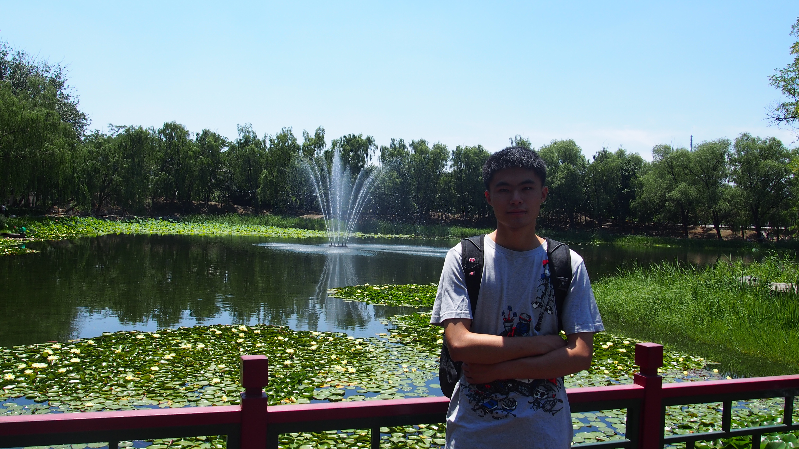

----

# Biography
I am currently a PhD student at Department of Biological and Agricultural Engineering, NC State University. I came to NC State after completing my Master’s degree in environmental engineering at Chinese Research Academy of Environmental Sciences in China. During my master’s study, I focused on the application of plant carbon source in improving nitrate removal efficiency for treatment of nitrate-rich agricultural runoff by constructed wetlands and bioreactors. At NC State, I work on quantifying the water quality benefits of a stream restoration in the coastal plain of NC. The overarching questions that motivate my research are 1) whether stream restoration does improve water quality? 2) how do we precisely quantify and interpret the real impacts of stream restoration on water quality? 

