```{r echo=FALSE, message=FALSE, out.width="80%", fig.align='center'}
library(knitr)
include_graphics("images/rstudio.png")
```

----------

# Introduction
R is a language and environment for statistical computing and graphics. R provides a wide variety of statistical (linear and nonlinear modelling, classical statistical tests, time-series analysis, classification, clustering, …) and graphical techniques, and is highly extensible. One of R’s strengths is the ease with which well-designed publication-quality plots can be produced, including mathematical symbols and formulae where needed. The most important thing to me is it is open source and free software. While i prefer R Studio which is open source and enterprise-ready profession software for R. I think it is much more easier to use R Studio than R (You might think so as well).

I am not good at codeing all my life!!! NEVER! But I benefited a lot from courses in [Datacamp](https://www.datacamp.com/home) which is recommended by Dr. Nelson and Dr. Birgand. So go there and enjoy your R Studio-ing if you are interested (maybe not for free though :-D)! At first, you will find it is very annoying to use codes and remember which function makes this and which function makes that (if not, you might be nature-born data analyst). But for now, although i am not good at it, i really enjoy coding and R Studio-ing after grasping some basic R and R Markdown knowledge. Here, i combined experience from [DataCamp](https://www.datacamp.com/home) and myself to help you master it easier. To begin with, there are some basic programming notes you need to remember. You might want to jump right into data visualization portion, but data analysts usually spend around 80% of their time cleaning and tidying data, and only 20% of time plotting. So, let's get it started!

# Basic programming notes
```{r eval=FALSE}
args(sd) # Useful trick for inspecting the arguments of sd() function in a quick way

Or help(sd) # works well as well

install.packages("package name") # To install a package

library(package name) # To select this package

download.file(url, destfile, ...) # in system package
```

To convert the capital letter to lower case, use function `tolower()`. vise versa, `toupper()` is the opposite. Inspect our workspace with `dir()`. To summarize a vector, use `summary()` to obtain it. To traverse over a set of data like a list or vector, and calling the specified function for each item, use `lapply(X, FUN, ...)`. `FUN` means the function to be applied to each element of x. X is a vector or list or expression object. 

Relational operators
    
    == - Equality
    != - Inequality
    > - Greater than
    < - Less than
    >= - Greater than or equal to
    <= - Less than or equal to
    x %in% c(a, b, c), TRUE if x is in the vector c(a, b, c)
    
Logical operators
  
    & - AND
    | - OR
    ! - NOT

Answering the question which grades in your class are higher than 75? with a vector of logicals is not very insightful. It's much better to ask the question how many grades in your class are higher than 75? instead. You can answer such questions with the sum() function. Each TRUE you passs count as 1, each FALSE as 0. <span style="color:red;"> Just in the same way, you can use mean(); this will give you the proportion of TRUE values in the data structure you pass it. 

**else if statement**
```{r eval=FALSE}
if (condition) {
  expr
} else if (condition) {
  expr
} else {
  expr
}
```

**subsetting from dataset**
```{r eval=FALSE}
subset(x, subset, ...) # subset: logical expression indicating elements or rows to keep
```

**Useful math functions that R features:**
```{r eval=FALSE}
abs() calculate the absolute value.
sum() calculate the sum of all the values in a data structure.
mean() calculate the arithmetic mean.
round() Round the values to 0 decimal places by default. Try out ?round in the console for variations of round() and ways to change the number of digits to round to
```

**Differences between [, [[ and $**
Please refer to [Detailed explanation](https://www.r-bloggers.com/r-accessors-explained/)

-----------

# Operators

For the meaning of operators in R, you would like to see [here](https://www.tutorialspoint.com/r/r_operators.htm).

------

# Read flat/excel files
There are several ways to do it. Basically, for "utils" package which is already existed in system library, it is east to read a table using read.table() function as below: 

```{r eval=FALSE}
read.table("states.csv", header = TRUE/FALSE, sep = ",", stringsASFactors = FALSE)

read.csv("states.csv", stringsASFactors = TRUE/FALSE) # To read a csv file
```

Likewise, in the "readr" package, just use functions below:

```{r eval=FALSE}
read_csv(object, col_names = TRUE) # would be enough to import csv files

read_tsv(object) # to load txt files

read_delim(object, delim = "\t", col_names = ...) # function which is the main function of the "readr" package. StringsASFactors do not need to be specified in all three functions as "utils" package required

Extra important arguments: through skip and n_max arguments, you can control which part of your flat file you're actually importing into R. skip specifies the number of lines you're ignoring in the flat file before actually starting to import data. n_max specifies the number of lines you're actually importing.
```

For "data.table" package, function to import data is fread() function which is extremely perfect for lazy people. Despite the different seperators, freed() can easily read csv files without adding sep = ",/." or delim = ",/.".

For "readxl" package, there are two main functions that useed for importing excel sheets into R. 
```{r eval=FALSE}
One is excel_sheets() # to list different sheets

the other one is read_excel() # to actually import data into R. To explain the arguments in detail, see below:

read_excel(path, sheet = 1, col_names = TRUE (by default), col_types = numeric/date/NULL, skip = 0/1/2...) # to specify what excel you wanna import. If you selected Null as col_types, then that column will not be shown in final printout.
```

For "gdata" package, we can utilize 
```{r eval=FALSE}
read.xls(".xls", sheet = 1/2/3... or "sheet name") # to import a xls file into R
```

For "XLConnect" Package, it bridges between Exccel and R. works with xls and xlsx files. Remember to use "lapply" to read all sheets automatically. XLConnect package can make it able to edit excel files from inside R, whose functions are shown below.
```{r eval=FALSE}
loadWorkbook(filename...) # To build a connection between R and xlsx files

createSheet(object, "sheet name") # To create a new sheet in excel files

readWorksheet(object, sheet = 1/2/3..., startCol = 1/2/3..., endCol = 1/2/3...) # To import selected columns to R 

writeWorksheet(object, data, sheet, ...) # load new data into new sheet created

saveWorkbook(object, file) # save the new sheet with a file name
renameSheet(object, sheet, newName) # rename a sheet

removeSheet(object, sheet) # remove sheets
getSheets(object) # to list all sheets in R

For example, lapply(getSheets(loadWorkbook(".xlsx file")), readWorksheet, object = ".xlsx file")
```

****************
# connecting to a database
The first step to import data from a SQL database is creating a connection to it. We might need different packages depending on the database you want to connect to. All of these packages do this in a uniform way, as specified in the "DBI" or "RMySQL" package. If the MySQL database is a remote database hosted on a server, you'll also have to specify the following arguments in dbConnect(): dbname, host, port, user and password. For example,
```{r eval=FALSE}
con <- dbConnect(RMySQL::MySQL(), 
                 dbname = "tweater", 
                 host = "courses.csrrinzqubik.us-east-1.rds.amazonaws.com", 
                 port = 3306,
                 user = "student",
                 password = "datacamp")

* I do not really know what the hell is going on with database connection. Just a note for future use.
```

List and import tables in the database:
```{r eval=FALSE}
dbListTables(DBIConnection object as produced by "dbConnect" function) # list all tables in the database

dbReadTable(object, "column/table name") # to tell R that which data you wanna import

dbDisconnect(object) #  is polite to disconnect the databases after you are done
```

In your life as a data scientist, you'll often be working with huge databases that contain tables with millions of rows. If you want to do some analyses on this data, it's possible that you only need a fraction of this data. In this case, it's a good idea to send SQL queries to your database, and only import the data you actually need into R. dbGetQuery() is what you need. As usual, you first pass the connection object to it. The second argument is an SQL query in the form of a character string. This example selects the age variable from the people dataset where gender equals "male":
```{r eval=FALSE}
dbGetQuery(con, "SELECT age, name FROM people WHERE gender = or > or < 'male' AND ... > ...")
```

****************
### Import data from the web
Pay attention to http:// and https://. There is, however, a safer alternative to HTTP, namely HTTPS, which stands for HypterText Transfer Protocol Secure. Just remember this: HTTPS is relatively safe, HTTP is not. We can use the standard importing functions with https:// connections since R version 3.2.2

you can read excel files on the web using the read_excel package by first downloading the file with the download.file() function. There's more: with download.file() you can download any kind of file from the web, using HTTP and HTTPS: images, executable files, but also .RData files. An RData file is very efficient format to store R data. You can load data from an RData file using the load() function, but this function does not accept a URL string as an argument.
```{r eval=FALSE}
load(file, envir = parent.frame(), verbose = FALSE) # file: a readable connection or a character string giving the name of the file to load; envir: the environment where the data should be loaded; verbose: should item names be printed during loading?
```

Downloading a file from the Internet means sending a GET request and receiving the file you asked for. Internally, all the previously discussed functions use a GET request to download files. "httr" package provides a convenient function, GET() to execute this GET request. The result is a response object, that provides easy access to the status code, content-type and, of course, the actual content. You can extract the content from the request using the content() function. At the time of writing, there are three ways to retrieve this content: as a raw object, as a character vector, or an R object, such as a list. If you don't tell content() how to retrieve the content through the as argument, it'll try its best to figure out which type is most appropriate based on the content-type.
```{r eval=FALSE}
download.file(object, "file name")

GET()

content() 
```

For "jsonlite" package, In the simplest setting, fromJSON() can convert character strings that represent JSON data into a nicely structured R list. Let's take a look at an example,
```{r eval=FALSE}
# wine_json is a JSON
wine_json <- '{"name":"Chateau Migraine", "year":1997, "alcohol_pct":12.4, "color":"red", "awarded":false}'
# Convert wine_json into a list: wine
wine <- fromJSON(wine_json)
# Print structure of wine
str(wine)
```

We can also get a data frame by naming the columns:
```{r eval=FALSE}
json2 <- '{"a": [1, 2, 3], "b": [4, 5, 6]}' # a contains 1, 2, 3; b contains 4, 5, 6
fromJSON(json2)
```

Apart from converting JSON to R with fromJSON(), you can also use toJSON() to convert R data to a JSON format. In its most basic use, you simply pass this function an R object to convert to a JSON. The result is an R object of the class json, which is basically a character string representing that JSON.
```{r eval=FALSE}
toJSON(x, ...) # x is the object to be encoded
```

****************
# Import data from statistical softwares (like SAS, STATA, SPSS) into R
Two packages can be useful to do this. One is "haven", the other is "foreign" package. "haven" can deal with data from SAS, STATA and SPSS. For "haven" package 
```{r eval=FALSE}
read_sas() # to import SAS data

read_dta()
read_stata() # to import STATA data (dta or stata files)

read_spss()
read_por()
read_sav() # to import SPSS data (por or sav files)
```

Subset example:
```{r eval=FALSE}
subset(traits, Extroversion > 40 & Agreeableness > 40) # Use & to stand for "and".
```

You learned how to import a data file using the command read_sav(). With SPSS data files, it can also happen that some of the variables you import have the labelled class. This is done to keep all the labelling information that was originally present in the .sav and .por files. It's advised to coerce (or change) these variables to factors or other standard R classes.
```{r eval=FALSE}
as.factor() # to convert lable as a factor
```

For "foreign" package, it offers a simple function to import and read STATA data: read.dta(). The arguments you will use most often are convert.dates, convert.factors, missing.type and convert.underscore, besides object. It's all about correctly converting STATA data to standard R data structures. Where foreign provided read.dta() to read Stata data, there's also read.spss() to read SPSS data files. To get a data frame, make sure to set to.data.frame = TRUE inside read.spss(). 

****************
# Cleaning and tidying data
Understanding the structure of your data.

First, view its class by class(); Second, view its dimensions by dim(). Third, look at column names by names(). Fourth, to summarize data by summary(). Like str() function, we use the dplyr package to view structure of object as well.
```{r eval=FALSE}
glimpse(object)
```

View the top (top six rows) by head(object, n = ...) function, n means how many rows you wanna show in R. While tail(object, n = ...) is to show the last six rows (by default) you wanna print out. 

****************
## Visualizing your data
```{r eval=FALSE}
hist(object) # to view histogram plot of a single variable

plot(x, y) # to view plot of two variables
```

Principles of tidy data: observations as rows, variables/attributes as columns. Remember that column headers are values, not variable names.

For "tydyr" package, 
```{r eval=FALSE}
gather(data, key, value, -...) # data: a data frame; key: bare name of new key column; value: bare name of new value column or changed column in other words; -...: bare names of columns to not gather or change
mbta4 <- gather(mbta3, "month", "thou_riders", -mode) # example

spread(data, key, value) # is the opposite of gather() function. key: bare name of column containing keys; value: bare name of column containing values

seperate(data, col, into) # data: a data frame; col: bare name of column to seperate; into: character vector of new column names (probably use a c() function to form a vector)

unite(data, col, ..., sep = "...") # is the opposite of seperate() function. data: a data frame; col: bare name of new column; ...: bare names of columns to unite (don't need a c() function, just use comma), sep: seperator used between tow joined columns
```

For more information about `tidyr` package, please refer to [here](https://www.cnblogs.com/nxld/p/6060533.html)

* Removing redundant info
```{r eval=FALSE}
my_df[1:5, ] # First 5 rows of my_df
my_df[, 4]   # Fourth column of my_df

my_df[-(1:5), ] # Omit first 5 rows of my_df
my_df[, -4]     # Omit fourth column of my_df
```

****************
## Type conversions
It is often necessary to change, or coerce, the way that variables in a dataset are stored. This could be because of the way they were read into R (with read.csv(), for example) or perhaps the function you are using to analyze the data requires variables to be coded a certain way. Only certain coercions are allowed, but the rules for what works are generally pretty intuitive. For example, trying to convert a character string to a number gives an error: as.numeric("some text"). There are a few less intuitive results. For example, under the hood, the logical values TRUE and FALSE are coded as 1 and 0, respectively. Therefore, as.logical(1) returns TRUE and as.numeric(TRUE) returns 1.

```{r eval=FALSE}
as.character(...)
as.factor(...)
as.integer(...)
as.numeric(...)
as.logical(...)
```

Dates can be a challenge to work with in any programming language, but thanks to the lubridate package, working with dates in R isn't so bad. Since this course is about cleaning data, we only cover the most basic functions from lubridate to help us standardize the format of dates and times in our data.

As you saw in the video, these functions combine the letters y, m, d, h, m, s, which stand for year, month, day, hour, minute, and second, respectively. The order of the letters in the function should match the order of the date/time you are attempting to read in, although not all combinations are valid. Notice that the functions are "smart" in that they are capable of parsing multiple formats.

    . ymd()
    . ymd_hms()
    . ...just ?ymd or ?ymd_hms, you will find out which function you want.

## String manipulation ("stringr" package)
There are four key functions in stringr for cleaning data:

    -str_trim() - Trim leading and trailing white space
    -str_pad - Pad with additional characters
    -str_detect() - Detect a pattern
    -str_replace() - Find and replace a pattern

One common issue that comes up when cleaning data is the need to remove leading and/or trailing white space. The str_trim() function from stringr makes it easy to do this while leaving intact the part of the string that you actually want.

```{r eval=FALSE}
str_trim("   this is a test     ") # it would print out "this is a test". very easy, huh?
```

A similar issue is when you need to pad strings to make them a certain number of characters wide. One example is if you had a bunch of employee ID numbers, some of which begin with one or more zeros. When reading these data in, you find that the leading zeros have been dropped somewhere along the way (probably because the variable was thought to be numeric and in that case, leading zeros would be unnecessary.)

```{r eval=FALSE}
str_pad("24493", width = 7, side = "left", pad = "0")
[1] "0024493"
```

The stringr package provides two functions that are very useful for finding and/or replacing strings: str_detect() and str_replace(). Like all functions in stringr, the first argument of each is the string of interest. The second argument of each is the pattern of interest. In the case of str_detect(), this is the pattern we are searching for. In the case of str_replace(), this is the pattern we want to replace. Finally, str_replace() has a third argument, which is the string to replace with.

```{r eval=FALSE}
str_detect(string, pattern) # string: input string; pattern: pattern to look for.

str_replace(string, pattern, replacement) # replacement: a character vector of replacements.
```

****************
## Finding and dealing with missing values
As you've seen, missing values in R should be represented by NA, but unfortunately you will not always be so lucky. Before you can deal with missing values, you have to find them in the data. If missing values are properly coded as NA, the is.na() function will help you find them. Otherwise, if your dataset is too big to just look at the whole thing, you may need to try searching for some of the usual suspects like "", "#N/A", etc. You can also use the summary() and table() functions to turn up unexpected values in your data. 

```{r eval=FALSE}
is.na(x) # an R object to be tested.

any(is.na(x)) # to identify whether there is any NA in the dataset.

sum(is.na(x)) # to count number of TRUEs

which(is.na(x)) # to find indices of missing values. very useful to replace data in the dataset
```

Missing values can be a rather complex subject, but here we'll only look at the simple case where you are simply interested in normalizing and/or removing all missing values from your data. For more information on why this is not always the best strategy, search online for "missing not at random."

```{r eval=FALSE}
complete.cases(object, ...) # to see which rows have no missing values

na.omit(object, ...) # to remove all rows with any missing values
```

## Identifying outliers and obvious errors
summary() and hist() are most useful functions to identify outliers. Another useful way of looking at strange values is with boxplots boxplot(). Simply put, boxplots draw a box around the middle 50% of values for a given variable, with a bolded horizontal line drawn at the median. Values that fall far from the bulk of the data points (i.e. outliers) are denoted by open circles. 

There are a number of stylistic conventions in the R language. Depending on who you ask, these conventions may vary. Because the period (.) has special meaning in certain situations, we generally recommend using underscores (_) to separate words in variable names. We also prefer all lowercase letters so that no one has to remember which letters are uppercase or lowercase.

## dplyr package
a **tbl** (pronounced tibble) is just a special kind of data.frame. They make your data easier to look at, but also easier to work with. On top of this, it is straightforward to derive a tbl from a data.frame structure using **tbl_df()**.

Notes: Modifying data with lookup tables. Please refer to [Nice R Code](https://nicercode.github.io/). 

The dplyr package contains five key data manipulation functions, also called verbs:

```{r eval=FALSE}
select(df, var1, var2...) # which returns a subset of the columns,
filter(tbl, logical test) # that is able to return a subset of the rows,
arrange(tbl, column name) # that reorders the rows according to single or multiple variables,
mutate(tbl, new column name = r expression that calculate the new variable) # used to add columns from existing data, not establish a completely new, for example, if you have length, width and height variables, you can add a volume variable in the tbl by length * width * height.
summarise() # which reduces each group to a single row by calculating aggregate measures.
```

Anyhow, dplyr comes with a set of helper functions that can help you select groups of variables inside a select() call:

```{r eval=FALSE}
starts_with("X") # every name that starts with "X",
ends_with("X") # every name that ends with "X",
contains("X") # every name that contains "X",
matches("X") # every name that matches "X", where "X" can be a regular expression,
num_range("x", 1:5) # the variables named x01, x02, x03, x04 and x05,
one_of(x) # every name that appears in x, which should be a character vector.
```

**Pay attention here**: When you refer to columns directly inside select(), you don't use quotes. If you use the helper functions, you do use quotes.

With lapply(), you could use `[[` to select specific elements from your list. The same thing is true for sapply()! Once you know about vapply(), there's really no reason to use sapply() anymore. If the output that lapply() would generate can be simplified to an array, you'll want to use vapply() to do this securely. If simplification is not possible, simply stick to lapply(). 

The droplevels() function removes unused levels of factor variables from your dataset. As you saw in the video, it's often useful to determine which levels are unused (i.e. contain zero values) with the table() function.

load data by data() function in dplyr package. use group_by() function to [group indexes together](https://blog.csdn.net/qq_28219759/article/details/52963773).

## Sampling from dataset
**Simple random sample in R**
```{r eval=FALSE}
# Simple random sample
states_srs <- us_regions %>%
  sample_n(8)

# Count states by region
states_srs %>%
  group_by(region) %>%
  count()
```

**Stratufied sample in R**
```{r eval=FALSE}
# Stratified sample
states_str <- us_regions %>%
  group_by(region) %>%
  sample_n(2)

# Count states by region
states_str %>%
  group_by(region) %>%
  count()
```

**Principles of experimental design**
Control: compare treatment of interest to a control group
Randomize: randomly assign subjects to treatments
Replicate: collect a sufficiently large sample within a study, or replicate the entire study
Block: account for the potential effect of confounding variables
  - group subjects into blocks based on these variables
  - randomize within each block to treatment groups

The difference between numerical and categorical type is show at [here](https://www.zhihu.com/question/41484616?sort=created)

**Conditional proportions**
The following code generates tables of joint and conditional proportions, respectively:
```{r eval=FALSE}
tab <- table(comics$align, comics$gender)
options(scipen = 999, digits = 3) # Print fewer digits
prop.table(tab)     # Joint proportions
prop.table(tab, 2)  # Conditional on columns, make column add to 1
```

------

# Intro to Statistics with R
## Binwidth

```{r eval=FALSE}
# Create hist of horsepwr with binwidth of 3
cars %>%
  ggplot(aes(horsepwr)) +
  geom_histogram(binwidth = 3) +
  ggtitle("binwidth = 3")
# Create hist of horsepwr with binwidth of 30
cars %>% 
  ggplot(aes(horsepwr)) +
  geom_histogram(binwidth = 30) +
  ggtitle("binwidth = 30")
# Create hist of horsepwr with binwidth of 60
cars %>%
  ggplot(aes(horsepwr)) +
  geom_histogram(binwidth = 60) +
  ggtitle("binwidth = 60")
```

```{r echo=FALSE, message=FALSE, out.width="50%"}
include_graphics(list.files("images/", pattern = "binwidth", full.names = TRUE))
```

```{r eval=FALSE}
# Compute groupwise measures of spread
gap2007 %>%
  group_by(continent) %>%
  summarize(sd(lifeExp),
            IQR(lifeExp),
            n())

# Generate overlaid density plots
gap2007 %>%
  ggplot(aes(x = lifeExp, fill = continent)) +
  geom_density(alpha = 0.3)
```

```{r echo=FALSE, message=FALSE, out.width="70%", fig.align='center'}
include_graphics("images/another21.png")
```

Highly skewed distributions can make it very difficult to learn anything from a visualization. Transformations can be helpful in revealing the more subtle structure.

```{r eval=FALSE}
# Create density plot of old variable
gap2007 %>%
  ggplot(aes(x = pop)) +
  geom_density()
# Transform the skewed pop variable
gap2007 <- gap2007 %>%
  mutate(log_pop = log(pop))
# Create density plot of new variable
gap2007 %>%
  ggplot(aes(x = log_pop)) +
  geom_density()
```

```{r echo=FALSE, message=FALSE, out.width="50%"}
include_graphics(list.files("images/", pattern = "skewed", full.names = TRUE))
```

## Identify Outliers
```{r eval=FALSE}
# Filter for Asia, add column indicating outliers
gap_asia <- gap2007 %>%
  filter(continent == "Asia") %>%
  mutate(is_outlier = lifeExp < 50)
# Remove outliers, create box plot of lifeExp
gap_asia %>% 
  filter(!is_outlier) %>%
  ggplot(aes(x = 1, y = lifeExp)) +
  geom_boxplot()
```

```{r echo=FALSE, message=FALSE, out.width="50%"}
include_graphics(list.files("images/", pattern = "outliers", full.names = TRUE))
```

```{reval=FALSE}
# Alternative plot: side-by-side box plots
email %>%
  mutate(log_exclaim_mess = log(exclaim_mess + .01)) %>% # change log(0) which is -Inf to the quantity inside the log()
  ggplot(aes(x = 1, y = log_exclaim_mess)) +
  geom_boxplot() +
  facet_wrap(~ spam)
# Alternative plot: Overlaid density plots
email %>%
  mutate(log_exclaim_mess = log(exclaim_mess + .01)) %>%
  ggplot(aes(x = log_exclaim_mess, fill = spam)) +
  geom_density(alpha = 0.3)
```

```{r echo=FALSE, message=FALSE, out.width="50%"}
include_graphics(list.files("images/", pattern = "spam", full.names = TRUE))
```

**Boxplots as discretized/conditioned scatterplots**

```{r eval=FALSE}
ggplot(data = ncbirths, 
       aes(x = cut(weeks, breaks = 5), y = weight)) + 
  geom_boxplot()
```

```{r echo=FALSE, message=FALSE, out.width="70%", fig.align='center'}

```

**Transformation**

```{r eval=FALSE}
# Scatterplot with coord_trans()
ggplot(data = mammals, aes(x = BodyWt, y = BrainWt)) +
  geom_point() + 
  coord_trans(x = "log10", y = "log10")
# Scatterplot with scale_x_log10() and scale_y_log10()
ggplot(data = mammals, aes(x = BodyWt, y = BrainWt)) +
  geom_point() +
  scale_x_log10() + scale_y_log10()
```

```{r echo=FALSE, message=FALSE, out.width="50%"}
include_graphics(list.files("images/", pattern = "transformation", full.names = TRUE))
```

## Correlation

The `cor(x, y)` function will compute the Pearson product-moment correlation between variables, x and y. Since this quantity is symmetric with respect to x and y, it doesn't matter in which order you put the variables. At the same time, the `cor()` function is very conservative when it encounters missing data (e.g. NAs). The use argument allows you to override the default behavior of returning NA whenever any of the values encountered is NA. Setting the use argument to "pairwise.complete.obs" allows `cor()` to compute the correlation coefficient for those observations where the values of x and y are both not missing. [This website](http://bbs.pinggu.org/thread-3675473-1-1.html) gives a detailed introduction to `cor()` function.

By the way, `group_by()` function has always been used in R. It might be easier for you to understand the function if you take a look at an example [here](https://blog.csdn.net/hao1066821456/article/details/69556644). 

## Fitting a linear model "by hand"
Recall the simple linear regression model: 

Y = b0 + b1 * X

Two facts enable you to compute the slope b1 and intercept b0 of a simple linear regression model from some basic summary statistics. First, the slope can be defined as:

b1 = r(X,Y) * sY / sX where r(X,Y)  represents the correlation (cor()) of X and Y and sX and sY represent the standard deviation (sd()) of X and Y, respectively.

Second, the point (x¯,y¯) is always on the least squares regression line, where x¯ and y¯ denote the average of x and y, respectively.

**Fitting simple linear models**

An `lm()` object contains a host of information about the regression model that you fit. There are various ways of extracting different pieces of information. The `oef()` function displays only the values of the coefficients. Conversely, the `summary()` function displays not only that information, but a bunch of other information, including the associated standard error and p-value for each coefficient, the R2, adjusted R2, and the residual standard error.

```{r eval=FALSE}
mod <- lm(wgt ~ hgt, data = bdims)
# Show the coefficients
coef(mod)
# Show the full output
summary(mod)
```

The `augment()` function from the `broom` package can tidy linear model. It takes a model object as an argument and returns a data frame that contains the data on which the model was fit, along with several quantities specific to the regression model, including the fitted values, residuals, leverage scores, and standardized residuals.

**Adding a regression line to a plot manually**

```{r eval=FALSE}
# Add the line to the scatterplot
ggplot(data = bdims, aes(x = hgt, y = wgt)) + 
  geom_point() + 
  geom_abline(data = coefs, 
              aes(intercept = `(Intercept)`, slope = hgt),  
              color = "dodgerblue")
```

```{r echo=FALSE, message=FALSE, out.width="70%", fig.align='center'}

```

## Assessing model fit
Calculate the stanard error of residuals/RMSE (Root mean squared error). 

```{r eval=FALSE}
# Compute the mean of the residuals
mean(residuals(mod))
# Compute RMSE
sqrt(sum(residuals(mod)^2) / df.residual(mod))
```

**Leverage**

The leverage of an observation in a regression model is defined entirely in terms of the distance of that observation from the mean of the explanatory variable. That is, observations close to the mean of the explanatory variable have low leverage, while observations far from the mean of the explanatory variable have high leverage. Points of high leverage may or may not be influential. The influence of an observation depends not only on its leverage, but also on the magnitude of its residual. Recall that while leverage only takes into account the explanatory variable (x), the residual depends on the response variable (y) and the fitted value (y^).


# `ggplot2` Visualization
An awesome website was recommended to you [ggplot2](http://ggplot2.tidyverse.org/index.html)

* Limitations of base plot functions
  - Plot does not get redrawn
  - Plot is drawn as an image
  - Need to manually add legend
  - No unified framework for plotting

* All Grammatical Elements:
  - Data, the dataset being plotted
  - Aesthetics, the scales onto which we map our data
  - Geometries, the visual elements used for our data
  - Facets, plotting small multiples
  - Statistics, representations of our data to aid understanding
  - Coordinates, the space on which the data will be plotted
  - Themes, all non-data ink

* Typical Aesthetics
  - x, X axis position
  - y, y axis position
  - colour, colour of dots, outlines of other shapes
  - fill, fill colour
  - size, diameter of points, thickness of lines
  - alpha, transparency
  - linetype, line dash pattern
  - labels, text on a plot or axes
  - shape, shape

```{r echo=FALSE, message=FALSE, out.width="60%", fig.align='center'}
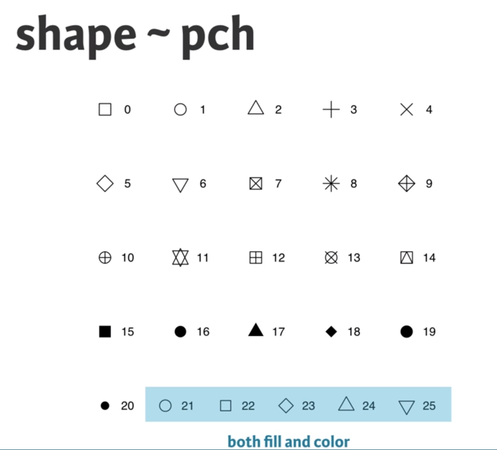
```

```{r echo=FALSE}
read.csv("data/ggplot_aesthetics.csv")
```

```{r eval=FALSE}
ggplot(mtcars, aes(x = cyl, y = mpg, col = disp, size = disp, shape = categorical column, shape = 1, size = 4)) + 
  geom_point(alpha = 0.4, position = "jitter") + # alpha means the transparency of discrete points, 0-1, jitter expands the points more evenly, or you can just use geom_jitter()
  geom_smooth(aes(group = 1), method = "lm", se = FALSE) # if you do not want any error shading, you can set se = FALSE, lm means lineal model method in scatter plot, group = 1 tells ggplot to draw a single linear model through all the points in different colors.
```

Note that you can also call `aes()` within the `geom_point()` function. Which shape to use? The default geom_point() uses shape = 19 (a solid circle with an outline the same colour as the inside). Good alternatives are shape = 1 (hollow) and shape = 16 (solid, no outline). These all use the col aesthetic (don't forget to set alpha for solid points). A really nice alternative is shape = 21 which allows you to use both fill for the inside and col for the outline! This is a great little trick for when you want to map two aesthetics to a dot. 

```{r eval=FALSE}
ggplot(mtcars, aes(x = wt, y = mpg, fill = cyl, col = am, shape = 21, size = 4, label = cyl)) +
  geom_point(alpha = 0.6) +
  geom_text()
```

This time you'll use these arguments to set attributes of the plot, not aesthetics. However, there are some pitfalls you'll have to watch out for: these attributes can overwrite the aesthetics of your plot! **A word about shapes:** In the exercise "All about aesthetics, part 2", you saw that shape = 21 results in a point that has a fill and an outline. Shapes in R can have a value from 1-25. Shapes 1-20 can only accept a color aesthetic, but shapes 21-25 have both a color and a fill aesthetic.
```{r eval=FALSE}
ggplot(mtcars, aes(x=wt, y=mpg, col=cyl)) +
geom_point(col = my_color)
# The col setting in geom_point can overwrite the aesthetics of plot
```

**A word about hexadecimal colours**: Hexadecimal, literally "related to 16", is a base-16 alphanumeric counting system. Individual values come from the ranges 0-9 and A-F. This means there are 256 possible two-digit values (i.e. 00 - FF). Hexadecimal colours use this system to specify a six-digit code for Red, Green and Blue values ("#RRGGBB") of a colour (i.e. Pure blue: "#0000FF", black: "#000000", white: "#FFFFFF"). R can accept hex codes as valid colours.

```{r eval=FALSE}
ggplot(mtcars, aes(x = wt, y = mpg, fill = cyl)) +
geom_text(rownames(mtcars), col = "red")
# Remember specify characters with quotation makrs
```

```{r eval=FALSE}
val = c("#E41A1C", "#377EB8")
lab = c("Manual", "Automatic")
cyl.am +
  geom_bar(position = "dodge") +
  scale_x_discrete("Cylinders") + 
  scale_y_continuous("Number") +
  scale_fill_manual("Transmission", 
                    values = val,
                    labels = lab)
```

**Explaination to the code above:**  `scale_x_discrete()` takes as its only argument the x-axis label: "Cylinders". `scale_y_continuous()` takes as its only argument the y-axis label: "Number". `scale_fill_manual()` fixes the legend. The first argument is the title of the legend: "Transmission". Next, values and labels are set to predefined values for you. These are the colors and the labels in the legend. The result of above code will be like this:

```{r echo=FALSE, message=FALSE, out.width="70%", fig.align='center'}
include_graphics("images/bar1.png")
```

------------------
To make a univariable plot with `ggplot2`, we can set y = o in aesthetics. So far you've focused on scatter plots since they are intuitive, easily understood and very common. A major consideration in any scatter plot is dealing with overplotting. You'll encounter this topic again in the geometries layer, but you can already make some adjustments here.

* You'll have to deal with overplotting when you have:
  - Large datasets,
  - Imprecise data and so points are not clearly separated on your plot (you saw this in the video with the iris dataset),
  - Interval data (i.e. data appears at fixed values), or
  - Aligned data values on a single axis.
  - Large datasets
  - Aligned data values on a single axis

One very common technique that I'd recommend to always use when you have solid shapes it to use alpha blending (i.e. adding transparency). An alternative is to use hollow shapes. These are adjustments to make before even worrying about positioning.

```{r eval=FALSE}
ggplot(mtcars, aes(x = wt, y = mpg, col = cyl)) +
geom_point(size = 4, shape = 1, alpha = 0.6)
# shape = 1 will change points to hollow points which is good, alpha can improve the overplotting
```

The plot will be like:

```{r echo=FALSE, message=FALSE, out.width="70%", fig.align='center'}
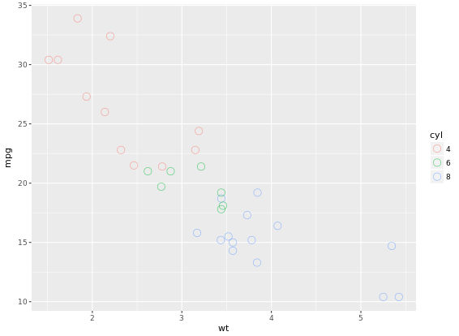
```

**37 Geometries in ggplot2**

* abline (scatter plot)
* area
* bar (bar plot)
* bin2d
* blank
* boxplot
* contour
* crossbar
* density
* density2d
* dotplot
* errorbar (bar plot)
* errorbarh
* freqpoly
* hex
* histogram (bar plot)
* hline
* jitter (scatter plot)
* line  (line plot)
* linerange
* map
* path
* point (scatter plot)
  - Essential: x, y
  - Optional: alpha, colour, fill, shape, size
* pointrange
* polygon
* quantile
* raster
* rect
* ribbon
* rug
* segment
* smooth
* step
* text
* tile
* violin
* vline

```{r eval=FALSE}
# 1 - Define posn_d with position_dodge()
posn_d <- position_dodge(width = 0.2)
# 2 - Use posn_d as position and adjust alpha to 0.6
ggplot(mtcars, aes(x = cyl, fill = am)) +
  geom_bar(position = posn_d, alpha = 0.6)
```

Result would be like:

```{r echo=FALSE, message=FALSE, out.width="70%", fig.align='center'}
include_graphics("images/bar2.png")
```

```{r eval=FALSE}
ggplot(mtcars, aes(mpg, col = cyl)) +
  geom_freqpoly(binwidth = 1, position = "identity")
```

```{r echo=FALSE, message=FALSE, out.width="70%", fig.align='center'}
include_graphics("images/freqpoly.png")
```

```{r eval=FALSE}
# Add the recess periods
ggplot(economics, aes(x = date, y = unemploy/pop)) +
  geom_rect(data = recess,
         aes(xmin = begin, xmax = end, ymin = -Inf, ymax = +Inf),
         inherit.aes = FALSE, fill = "red", alpha = 0.2) +
  geom_line()
```

```{r echo=FALSE, message=FALSE, out.width="70%", fig.align='center'}
include_graphics("images/line1.png")
```

```{r eval=FALSE}
# Make it easy to read
ggplot(ChickWeight, aes(x = Time, y = weight, col = Diet)) +
  geom_line(aes(group = Chick), alpha = 0.3) +
  geom_smooth(lwd = 2, se = FALSE)
```

```{r echo=FALSE, message=FALSE, out.width="70%", fig.align='center'}
include_graphics("images/line2.png")
```

While `qplot()` can do some easy plots like that:
```{r eval=FALSE}
# qplot() with geom set to jitter manually
qplot(factor(cyl), factor(vs), data = mtcars, geom = "jitter")
```

```{r echo=FALSE, message=FALSE, out.width="70%", fig.align='center'}
include_graphics("images/qplot1.png")
```

```{r eval=FALSE}
# "True" dot plot, with geom_dotplot():
ggplot(mtcars, aes(cyl, wt, fill = am)) +
  geom_dotplot(binaxis = "y", stackdir = "center")
```

```{r echo=FALSE, message=FALSE, out.width="70%", fig.align='center'}
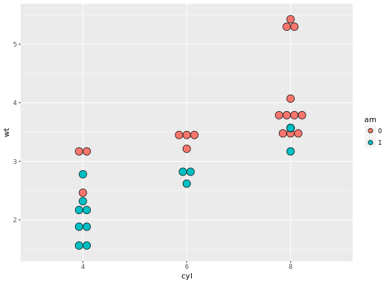
```

```{r eval=FALSE}
# add facet_grid() layer
ggplot(titanic, aes(x = Pclass, fill = Sex)) +
  geom_bar(position = "dodge") +
  facet_grid(. ~ Survived)
# Define an object for position jitterdodge, to use below
posn.jd <- position_jitterdodge(0.5, 0, 0.6)
# but use the position object defined above
ggplot(titanic, aes(x = Pclass, y = Age, color = Sex)) +
  geom_point(size = 3, alpha = 0.5, position = posn.jd) +
  facet_grid(. ~ Survived)
```

Two figures are compared: 

```{r echo=FALSE, message=FALSE, out.width="50%"}
include_graphics(list.files("images/", pattern = "jitter", full.names = TRUE))
```

# Advanced plotting with `ggplot2`

```{r echo=FALSE, message=FALSE, out.width="70%", fig.align='center'}
include_graphics("images/stat_functions.png")
```

```{r eval=FALSE}
ggplot(mtcars, aes(x = wt, y = mpg, col = factor(cyl))) +
  geom_point() +
  stat_smooth(method = "lm", se = FALSE)

# 2 - Plot 1, plus another stat_smooth() containing a nested aes()
ggplot(mtcars, aes(x = wt, y = mpg, col = factor(cyl))) +
  geom_point() +
  stat_smooth(method = "lm", se = FALSE) +
  stat_smooth(method = "lm", se = FALSE, aes(group = 1))
```

```{r echo=FALSE, message=FALSE, out.width="50%"}
include_graphics(list.files("images/", pattern = "smooth", full.names = TRUE))
```

In the previous exercise we used `se = FALSE` in `stat_smooth()` to remove the 95% Confidence Interval. Here we'll consider another argument, `span`, used in LOESS smoothing, and we'll take a look at a nice scenario of properly mapping different models.
```{r eval=FALSE}
ggplot(mtcars, aes(x = wt, y = mpg, col = factor(cyl))) +
  geom_point() +
  stat_smooth(method = "lm", se = FALSE) +
  stat_smooth(method = "loess", aes(group = 1),
              se = FALSE, col = "black", span = 0.7)

# Set col to "All", inside the aes layer of stat_smooth()
ggplot(mtcars, aes(x = wt, y = mpg, col = factor(cyl))) +
  geom_point() +
  stat_smooth(method = "lm", se = FALSE) +
  stat_smooth(method = "loess",
              # Add col inside aes()
              aes(group = 1, col = "All"),
              # Remove the col argument below
              se = FALSE, span = 0.7)

# Add scale_color_manual to change the colors
myColors <- c(brewer.pal(3, "Dark2"), "black")
ggplot(mtcars, aes(x = wt, y = mpg, col = factor(cyl))) +
  geom_point() +
  stat_smooth(method = "lm", se = FALSE, span = 0.7) +
  stat_smooth(method = "loess", 
              aes(group = 1, col="All"), 
              se = FALSE, span = 0.7) +
  scale_color_manual("Cylinders", values = myColors)
```

```{r echo=FALSE, message=FALSE, out.width="50%"}
include_graphics(list.files("images/", pattern = "multi", full.names = TRUE))
```

Focus on the color because `scale_color_brewer` on default have a maximum 9 for palette Blues.
```{r eval=FALSE}
ggplot(Vocab, aes(x = education, y = vocabulary, col = factor(year))) +
  stat_smooth(method = "lm", se = FALSE) +  # smooth
  scale_color_brewer()  # colors

# Plot 5: Add the group aes, specify alpha and size
ggplot(Vocab, aes(x = education, y = vocabulary, col = year, group = factor(year))) +
  stat_smooth(method = "lm", se = FALSE, alpha = 2, size = 2) +
  scale_color_gradientn(colors = brewer.pal(9, "YlOrRd"))
```

```{r echo=FALSE, message=FALSE, out.width="50%"}
include_graphics(list.files("images/", pattern = "color", full.names = TRUE))
```

Another useful stat function is `stat_sum()`. This function calculates the total number of overlapping observations and is another good alternative to overplotting.
```{r eval=FALSE}
# Jittering only
p <- ggplot(Vocab, aes(x = education, y = vocabulary)) +
  geom_jitter(alpha = 0.2)
# Add stat_sum will map overall count of each dot onto size
p +
  stat_sum()
# Set size range of the dots
p +
  stat_sum() + 
  scale_size(range = c(1, 10))
```

```{r echo=FALSE, message=FALSE, out.width="50%"}
include_graphics(list.files("images/", pattern = "stat_sum", full.names = TRUE))
```

```{r eval=FALSE}
library(ggplot2)
library(Hmisc)
wt.cyl.am <- ggplot(mtcars, aes(x = cyl,  y = wt, col = am, fill = am, group = am))
posn.d <- position_dodge(width = 0.1)
posn.jd <- position_jitterdodge(jitter.width = 0.1, dodge.width = 0.2)
posn.j <- position_jitter(width = 0.2)
# Plot 1: Jittered, dodged scatter plot with transparent points
wt.cyl.am +
  geom_point(position = posn.jd, alpha = 0.6)

# Plot 2: Mean and SD - the easy way
wt.cyl.am +
  geom_point(position = posn.jd, alpha = 0.6) +
  stat_summary(fun.data = mean_sdl, fun.args = list(mult = 1), position = posn.d)

# Plot 3: Mean and 95% CI - the easy way
wt.cyl.am +
  geom_point(position = posn.jd, alpha = 0.6) +
  stat_summary(fun.data = mean_cl_normal, position = posn.d)

# Plot 4: Mean and SD - with T-tipped error bars - fill in ___
wt.cyl.am +
  stat_summary(geom = "point", fun.y = mean,
               position = posn.d) +
  stat_summary(geom = "errorbar", fun.data = mean_sdl,
               position = posn.d, fun.args = list(mult = 1), width = 0.1)
```

```{r echo=FALSE, message=FALSE, out.width="50%"}
include_graphics(list.files("images/", pattern = "summary", full.names = TRUE))
```

```{r eval=FALSE}
# Add three stat_summary calls to wt.cyl.am
wt.cyl.am +
  stat_summary(geom = "linerange", fun.data = med_IQR,
               position = posn.d, size = 3) +
  stat_summary(geom = "linerange", fun.data = gg_range,
               position = posn.d, size = 3,
               alpha = 0.4) +
  stat_summary(geom = "point", fun.y = median,
               position = posn.d, size = 3,
               col = "black", shape = "X")
```

```{r echo=FALSE, message=FALSE, out.width="70%", fig.align='center'}
include_graphics("images/another.png")
```

```{r eval=FALSE}
p <- ggplot(mtcars, aes(x = wt, y = hp, col = am)) + geom_point() + geom_smooth()
# limits to set the aesthetic limit, expand is to ensure the data is placed some distance away from axes
p + scale_x_continuous(limits = c(3, 6), expand = c(0, 0))
# Add coord_cartesian(): the proper way to zoom in
p + coord_cartesian(xlim = c(3, 6))
```

```{r echo=FALSE, message=FALSE, out.width="50%"}
include_graphics(list.files("images/", pattern = "point", full.names = TRUE))
```

```{r eval=FALSE}
# Complete basic scatter plot function
base.plot <- ggplot(iris, aes(x = Sepal.Length, y = Sepal.Width, col = Species)) +
               geom_jitter() +
               geom_smooth(method = "lm", se = FALSE)
base.plot
# Fix aspect ratio (1:1) of base.plot
base.plot + coord_equal(ratio = 1)
base.plot + coord_equal(ratio = 2)
base.plot + coord_equal(ratio = 3)
```

```{r echo=FALSE, message=FALSE, out.width="50%"}
include_graphics(list.files("images/", pattern = "scale", full.names = TRUE))
```

```{r eval=FALSE}
wide.bar <- ggplot(mtcars, aes(x = 1, fill = cyl)) +
              geom_bar()
# Convert wide.bar to pie chart
wide.bar +
  coord_polar(theta = "y")
# Create stacked bar plot: thin.bar
thin.bar <- ggplot(mtcars, aes(x = 1, fill = cyl)) +
              geom_bar(width = 0.1) +
              scale_x_continuous(limits = c(0.5, 1.5))
# Convert thin.bar to "ring" type pie chart
thin.bar + 
  coord_polar(theta = "y")
```

```{r echo=FALSE, message=FALSE, out.width="50%"}
include_graphics(list.files("images/", pattern = "ring", full.names = TRUE))
```

```{r eval=FALSE}
# Basic scatter plot
p <- ggplot(mtcars, aes(x = wt, y = mpg)) +
  geom_point()
p +
  facet_grid(am ~ .)
# 2 - Separate columns according to column cylinders, cyl
p +
  facet_grid(. ~ cyl)
# 3 - Separate by both columns and rows 
p +
  facet_grid(am ~ cyl)
```

```{r echo=FALSE, message=FALSE, out.width="50%"}
include_graphics(list.files("images/", pattern = "facet_grid", full.names = TRUE))
```

**For many variables**
```{r eval=FALSE}
# Code to create the cyl_am col and myCol vector
mtcars$cyl_am <- paste(mtcars$cyl, mtcars$am, sep = "_")
myCol <- rbind(brewer.pal(9, "Blues")[c(3,6,8)],
               brewer.pal(9, "Reds")[c(3,6,8)])
ggplot(mtcars, aes(x = wt, y = mpg, col = cyl_am, size = disp)) +
  geom_point() +
  scale_color_manual(values = myCol) +
  facet_grid(gear ~ vs)
```

```{r echo=FALSE, message=FALSE, out.width="70%", fig.align='center'}
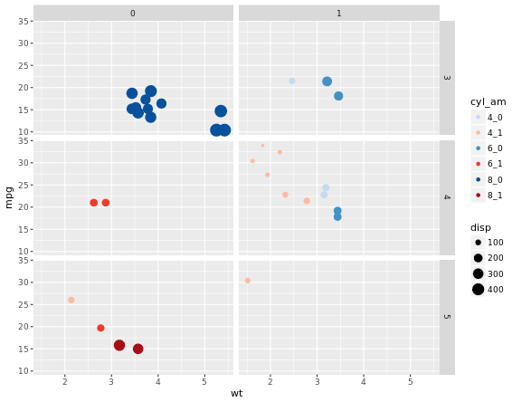
```

```{r eval=FALSE}
# Facet rows accoding to vore which is pretty hard to read, right?
p +
  facet_grid(vore ~ .)
# Specify scale and space arguments to free up rows
p +
  facet_grid(vore ~ ., scale = "free_y", space = "free_y")
```

```{r echo=FALSE, message=FALSE, out.width="70%", fig.align='center'}
include_graphics("images/free_y1.png")
```

```{r echo=FALSE, message=FALSE, out.width="70%", fig.align='center'}
include_graphics("images/free_y2.png")
```

# Themes layer
Let's look at an example first. How to transfer from left to right image?

```{r echo=FALSE, message=FALSE, out.width="50%"}
include_graphics(list.files("images/", pattern = "theme", full.names = TRUE))
```

## Rectangle
We can add `theme` element to original plot:
```{r eval=FALSE}
myPink <- "#FEE0D2"
# Theme to remove all rectangles
no_panels <- theme(rect = element_blank())
# Remove plot panels and legend and add a border, z is orginal figure
z +
  no_panels +
  theme(plot.background = element_rect(fill = myPink, color = "black", size = 3))
```

## Line
Next, you will think about removing grid lines in the previous figure. For each of the arguments that specify lines, use `element_line()` to create red axes and tick marks.

```{r eval=FALSE}
# z is previous figure code
z + 
  theme(panel.grid = element_blank(),
        axis.line = element_line(color = "red"),
        axis.ticks = element_line(color = "red"))
```

```{r echo=FALSE, message=FALSE, out.width="70%", fig.align='center'}
include_graphics("images/another2.png")
```

## Text
Now, we can make the text on your plot prettier and easier to spot. You can do this through the `element_text()` function and appropriate arguments inside the `theme()` function. The plot you've created previously is available as `z`.

```{r eval=FALSE}
z +
  theme(strip.text = element_text(size = 16, color = myRed),
        axis.title = element_text(color = myRed, hjust = 0, face = "italic"),
        axis.text = element_text(color = "black"))
```

## Legend
The themes layer also allows you to specify the appearance and location of legends. Previous code is available as z.
```{r eval=FALSE}
# Move legend by position
z +
  theme(legend.position = c(0.85, 0.85))
# Change direction
z +
  theme(legend.direction = "horizontal")
# Change location by name
z +
  theme(legend.position = "bottom")
# Remove legend entirely
z +
  theme(legend.position = "none")
```

```{r echo=FALSE, message=FALSE, out.width="50%"}
include_graphics(list.files("images/", pattern = "legend", full.names = TRUE))
```

## Positions
The different rectangles of your plot have spacing between them. There's spacing between the facets, between the axis labels and the plot rectangle, between the plot rectangle and the entire panel background, etc. The last plot you created in the previous exercise, without a legend, is available as `z`.

```{r eval=FALSE}
# Increase spacing between facets
library(grid)
z + theme(panel.spacing.x = unit(2, "cm"))
# Adjust the plot margin
z + theme(panel.spacing.x = unit(2, "cm"), plot.margin = unit(c(1,2,1,1), "cm"))
```

```{r echo=FALSE, message=FALSE, out.width="50%"}
include_graphics(list.files("images/", pattern = "panel_spacing", full.names = TRUE))
```

## Recycling Themes
If you are making many plots and wanna keep consistency in style, you might wanna apply specific theme everywhere because building your themes every time from scratch can become a pain and unnecessarily bloat your scripts. theme_update() updates the default theme used by ggplot2. The arguments for theme_update() are the same as for theme(). When you call theme_update() and assign it to an object (e.g. called old), that object stores the current default theme, and the arguments update the default theme. If you want to restore the previous default theme, you can get it back by using theme_update() again. In the following exercises, we'll practice different ways of managing, updating and saving themes.

```{r eval=FALSE}
# Update the theme as default theme
old <- theme_update(panel.background = element_blank(),
             legend.key = element_blank(),
             legend.background = element_blank(),
             strip.background = element_blank(),
             plot.background = element_rect(fill = myPink, color = "black", size = 3),
             panel.grid = element_blank(),
             axis.line = element_line(color = "red"),
             axis.ticks = element_line(color = "red"),
             strip.text = element_text(size = 16, color = myRed),
             axis.title.y = element_text(color = myRed, hjust = 0, face = "italic"),
             axis.title.x = element_text(color = myRed, hjust = 0, face = "italic"),
             axis.text = element_text(color = "black"),
             legend.position = "none")

# 3 - Display the plot z2 - new default theme used
z2
# 4 - Restore the old default theme
theme_set(old)
```

```{r echo=FALSE, message=FALSE, out.width="70%", fig.align='center'}
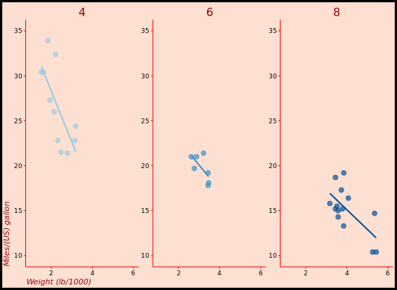
```

## Exploring ggthemes
Here is a nice website you can refer to, [All your figure are belong to us](https://yutannihilation.github.io/allYourFigureAreBelongToUs/ggthemes/). The author almost made a list of all whay you need in his/her website. 

```{r eval=FALSE}
library(ggthemes)
z2
# Apply theme_tufte(), plot additional modifications
custom_theme <- theme_tufte() +
  theme(legend.position = c(0.9, 0.9),
        legend.title = element_text(face = "italic", size = 12),
        axis.title = element_text(face = "bold", size = 14))

# Draw the customized plot
z2 + custom_theme
# Use theme_set to set custom theme as default
theme_set(custom_theme)
```

```{r echo=FALSE, message=FALSE, out.width="50%"}
include_graphics(list.files("images/", pattern = "element_text", full.names = TRUE))
```

# Bar Plots
"dynamite plots" (bar plots with error bars) are not well suited for their intended purpose of depicting distributions. If you really want error bars on bar plots, you can still get that. However, you'll need to set the positions manually. A point geom will typically serve you much better. For base layer:

```{r eval=FALSE}
m <- ggplot(mtcars, aes(x = cyl, y = wt))
# Draw dynamite plot
m +
  stat_summary(fun.y = mean, geom = "bar", fill = "skyblue") +
  stat_summary(fun.data = mean_sdl, fun.args = list(mult = 1), geom = "errorbar", width = 0.1)
```

```{r echo=FALSE, message=FALSE, out.width="70%", fig.align='center'}
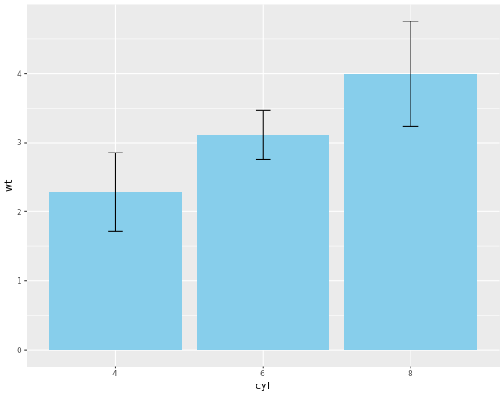
```

The plot is not that good, right? Let's handle it.
```{r eval=FALSE}
m <- ggplot(mtcars, aes(x = cyl,y = wt, col = am, fill = am))
# Plot 2: Set position dodge in each stat function which does not solve problem
m +
  stat_summary(fun.y = mean, geom = "bar", position = "dodge") +
  stat_summary(fun.data = mean_sdl, fun.args = list(mult = 1), 
               geom = "errorbar", width = 0.1, position = "dodge")
# Set your dodge posn manually
posn.d <- position_dodge(0.9)
# Plot 3: Redraw dynamite plot
m +
  stat_summary(fun.y = mean, geom = "bar", position = posn.d) +
  stat_summary(fun.data = mean_sdl, fun.args = list(mult = 1), geom = "errorbar", width = 0.1, position = posn.d)
```

```{r echo=FALSE, message=FALSE, out.width="50%"}
include_graphics(list.files("images/", pattern = "red", full.names = TRUE))
```

If it is appropriate to use bar plots (see the video for a discussion!), then it would also be nice to give an impression of the number of values in each group. stat_summary() doesn't keep track of the count. stat_sum() does (that's the whole point), but it's difficult to access. In this case, the most straightforward thing to do is calculate exactly what we want to plot beforehand. For this exercise we've created a summary data frame called mtcars.cyl which contains the average (wt.avg), standard deviations (sd) and count (n) of car weights, according to cylinders, cyl. It also contains the proportion (prop) of each cylinder represented in the entire dataset. Use the console to familiarize yourself with the mtcars.cyl data frame.

```{r eval=FALSE}
# Base layers
m <- ggplot(mtcars.cyl, aes(x = cyl, y = wt.avg))
# Plot 1: Draw bar plot with geom_bar
m + geom_bar(stat = "identity", fill = "skyblue")
# Plot 2: Draw bar plot with geom_col
m + geom_col(fill = "skyblue")
# Plot 3: geom_col with variable widths.
m + geom_col(fill = "skyblue", width = mtcars.cyl$prop)
# Plot 4: Add error bars
m +
  geom_col(fill = "skyblue", width = mtcars.cyl$prop) +
  geom_errorbar(aes(ymin = wt.avg - sd, ymax = wt.avg + sd), width = 0.1)
```

```{r echo=FALSE, message=FALSE, out.width="50%"}
include_graphics(list.files("images/", pattern = "geom_col", full.names = TRUE))
```

# Pie Charts
Convert bar chart to pie chart:

```{r eval=FALSE}
# Plot 1
ggplot(mtcars, aes(x = factor(1), fill = am)) +
  geom_bar(position = "fill") +
  facet_grid(. ~ cyl) + # Facets
  coord_polar(theta = "y") + # Coordinates
  theme_void()
# Plot 2
ggplot(mtcars, aes(x = factor(1), fill = am)) +
  geom_bar(position = "fill", width = 1) +
  facet_grid(. ~ cyl) + # Facets
  coord_polar(theta = "x") + # Coordinates
  theme_void()
# Plot 3
ggplot(mtcars, aes(x = factor(1), fill = am)) +
  geom_bar(position = "fill", width = 1) +
  facet_grid(. ~ cyl) + # Facets
  coord_polar(theta = "y") + # Coordinates
# Plot 4
ggplot(mtcars, aes(x = factor(1), fill = am)) +
  geom_bar(position = "fill", width = 1) +
  facet_grid(. ~ cyl) + # Facets
  coord_polar(theta = "y") + # Coordinates
  theme_void()
```

```{r echo=FALSE, message=FALSE, out.width="50%"}
include_graphics(list.files("images/", pattern = "pie", full.names = TRUE))
```

The trick is to use a parallel coordinates plot. Each variable is plotted on its own parallel axis. Individual observations are connected with lines, colored according to a variable of interest. This is a surprisingly useful visualization since we can combine many variables, even if they are on entirely different scales.

**A word of caution though**: typically it is very taboo to draw lines in this way. It's the reason why we don't draw lines across levels of a nominal variable - the order, and thus the slope of the line, is meaningless. Parallel plots are a (very useful) exception to the rule! But to be honest, i do not know much about this plot. To me, it is too complicated and meaningless when you first see it. It says it is an excellent example of an exploratory plot. In case i will explore it in the future, i will record it here.

```{r eval=FALSE}
# Parallel coordinates plot using GGally
library(GGally)
# All columns except am
group_by_am <- 9
my_names_am <- (1:11)[-group_by_am]
# Basic parallel plot - each variable plotted as a z-score transformation
ggparcoord(mtcars, my_names_am, groupColumn = group_by_am, alpha = 0.8)
```

```{r echo=FALSE, message=FALSE, out.width="70%", fig.align='center'}
include_graphics("images/another4.png")
```

# Plot Matrix
Another great example is a plot matrix. `GGally::ggpairs(mtcars2)` will produce the plot of a selection of the `mtcars` dataset, `mtcars2`.

```{r echo=FALSE, message=FALSE, out.width="50%"}
include_graphics(list.files("images/", pattern = "matrix", full.names = TRUE))
```

# Heat Maps
Just for exploratory thinking of your data, not good for publication though.

```{r eval=FALSE}
# Create color palette
myColors <- brewer.pal(9, "Reds")
# Build the heat map using geom_tile
ggplot(barley, aes(x = year, y = variety, fill = yield)) +
  geom_tile() + # Geom layer
  facet_wrap( ~ site, ncol = 1) + # ensure there is just one column
  scale_fill_gradientn(colors = myColors) # Adjust colors
```

```{r echo=FALSE, message=FALSE, out.width="70%", fig.align='center'}
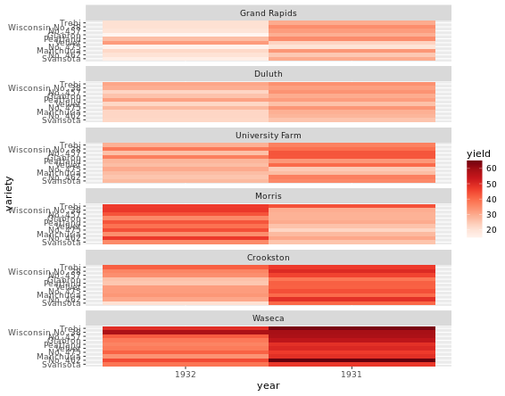
```

## Heat maps alternatives
There are several alternatives to heat maps. The best choice really depends on the data and the story you want to tell with this data.

```{r eval=FALSE}
# Line plot; check group argument meaning
ggplot(barley, aes(x = year, y = yield, col = variety, group = variety))  + 
  geom_line() + 
  facet_wrap( ~ site, nrow = 1)
```

```{r echo=FALSE, message=FALSE, out.width="70%", fig.align='center'}
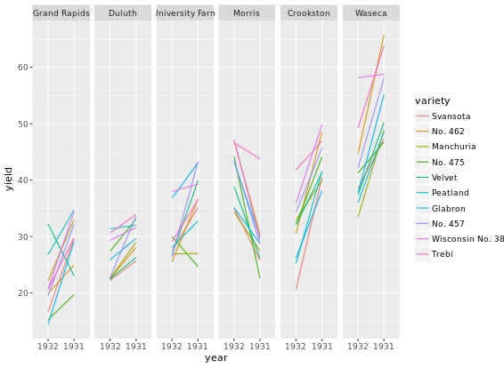
```

You can use dodged error bars or you can use overlapping transparent ribbons. We'll try to recreate the second option, the transparent ribbons here.

```{r eval=FALSE}
# Create overlapping ribbon plot from scratch
ggplot(barley, aes(x = year, y = yield, col = site, fill = site, group = site)) +
  stat_summary(fun.y = mean, geom = "line") +
  stat_summary(fun.data = mean_sdl, fun.args = list(mult = 1), geom = "ribbon", col = NA, alpha = 0.1)
```

```{r echo=FALSE, message=FALSE, out.width="70%", fig.align='center'}
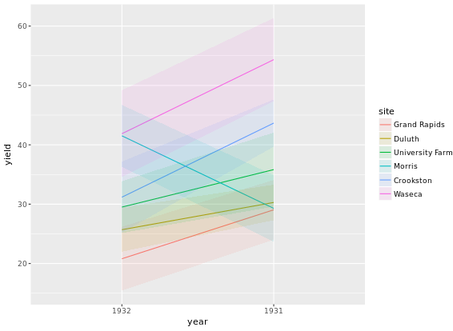
```

# Case Study

```{r eval=FALSE}
# Age colored by BMI, binwidth = 1
ggplot(adult, aes (x = SRAGE_P, fill= factor(RBMI))) + 
  geom_histogram(binwidth = 1)
```

```{r echo=FALSE, message=FALSE, out.width="70%", fig.align='center'}
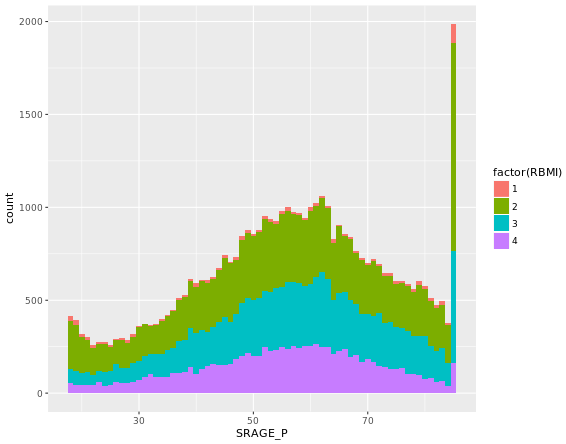
```

When we introduced histograms we focused on univariate data, which is exactly what we've been doing here. However, when we want to explore distributions further there is much more we can do. For example, there are density and frequency plots.

```{r eval=FALSE}
# The color scale used in the plot
BMI_fill <- scale_fill_brewer("BMI Category", palette = "Reds")
# Theme to fix category display in faceted plot
fix_strips <- theme(strip.text.y = element_text(angle = 0, hjust = 0, vjust = 0.1, size = 14),
                    strip.background = element_blank(),
                    legend.position = "none")
# Histogram, add BMI_fill and customizations
ggplot(adult, aes (x = SRAGE_P, fill= factor(RBMI))) + 
  geom_histogram(binwidth = 1) +
  fix_strips +
  BMI_fill +
  facet_grid(RBMI ~ .) +
  theme_classic()
```

```{r echo=FALSE, message=FALSE, out.width="70%", fig.align='center'}
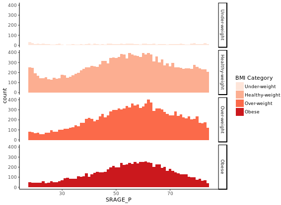
```

In the previous exercise we looked at different ways of showing the absolute count of multiple histograms. This is fine, but density would be a more useful measure if we wanted to see how the frequency of one variable changes across another. 

```{r eval=FALSE}
# Plot 1 - Count histogram
ggplot(adult, aes (x = SRAGE_P, fill= factor(RBMI))) +
  geom_histogram(binwidth = 1) +
  BMI_fill
# Plot 2 - Density histogram
ggplot(adult, aes (x = SRAGE_P, fill= factor(RBMI))) + 
  geom_histogram(aes(y = ..density..), binwidth = 1) +
  BMI_fill
# Plot 3 - Faceted count histogram
ggplot(adult, aes (x = SRAGE_P, fill= factor(RBMI))) +
  geom_histogram(binwidth = 1) +
  BMI_fill + 
  facet_grid(RBMI ~ .)
# Plot 4 - Faceted density histogram
ggplot(adult, aes (x = SRAGE_P, fill= factor(RBMI))) + 
  geom_histogram(aes(y = ..density..), binwidth = 1) +
  BMI_fill +
  facet_grid(RBMI ~ .)
# Plot 5 - Density histogram with position = "fill"
ggplot(adult, aes (x = SRAGE_P, fill= factor(RBMI))) + 
  geom_histogram(aes(y = ..density..), binwidth = 1, position = "fill") +
  BMI_fill
# Plot 6 - The accurate histogram
ggplot(adult, aes (x = SRAGE_P, fill= factor(RBMI))) + 
  geom_histogram(aes(y = ..count../sum(..count..)), binwidth = 1, position = "fill") +
  BMI_fill
```

```{r echo=FALSE, message=FALSE, out.width="50%"}
include_graphics(list.files("images/", pattern = "density", full.names = TRUE))
```

```{r eval=FALSE}
# An attempt to facet the accurate frequency histogram from before (failed)
ggplot(adult, aes (x = SRAGE_P, fill= factor(RBMI))) +
  geom_histogram(aes(y = ..count../sum(..count..)), binwidth = 1, position = "fill") +
  BMI_fill +
  facet_grid(RBMI ~ .)

# Create DF with table()
DF <- table(adult$RBMI, adult$SRAGE_P)
# Use apply on DF to get frequency of each group
DF_freq <- apply(DF, 2, function(x) x/sum(x)) # 2 means 2 columns
# Load reshape2 and use melt on DF to create DF_melted
library(reshape2)
DF_melted <- melt(DF_freq)
# Change names of DF_melted
names(DF_melted) <- c("FILL", "X", "value")
# Add code to make this a faceted plot
ggplot(DF_melted, aes(x = X, y = value, fill = FILL)) +
  geom_col(position = "stack") + # we can use geom_col instead of geom_bar(stat = "identity")
  BMI_fill + 
  facet_grid(FILL ~ .) # Facets
```

```{r echo=FALSE, message=FALSE, out.width="50%"}
include_graphics(list.files("images/", pattern = "stack", full.names = TRUE))
```

## Mosaic Plots (Useful)
You may have already realized that bars are simply rectangles, but we don't have easy access to the xmin and xmax aesthetics, but in geom_rect() we do! Likewise, we also have access to ymin and ymax. 
```{r eval=FALSE}
# The initial contingency table
DF <- as.data.frame.matrix(table(adult$SRAGE_P, adult$RBMI))
# Create groupSum, xmax and xmin columns
DF$groupSum <- rowSums(DF)
DF$xmax <- cumsum(DF$groupSum)
DF$xmin <- DF$xmax - DF$groupSum
# The groupSum column needs to be removed; don't remove this line
DF$groupSum <- NULL
# Copy row names to variable X
DF$X <- row.names(DF)
# Melt the dataset
library(reshape2)
DF_melted <- melt(DF, id.vars = c("X", "xmin", "xmax"), variable.name = "FILL")
# dplyr call to calculate ymin and ymax - don't change
library(dplyr)
DF_melted <- DF_melted %>%
  group_by(X) %>%
  mutate(ymax = cumsum(value/sum(value)),
         ymin = ymax - value/sum(value))
# Plot rectangles - don't change
library(ggthemes)
ggplot(DF_melted, aes(ymin = ymin,
                 ymax = ymax,
                 xmin = xmin,
                 xmax = xmax,
                 fill = FILL)) +
  geom_rect(colour = "white") +
  scale_x_continuous(expand = c(0,0)) +
  scale_y_continuous(expand = c(0,0)) +
  BMI_fill +
  theme_tufte()
```

```{r echo=FALSE, message=FALSE, out.width="70%", fig.align='center'}
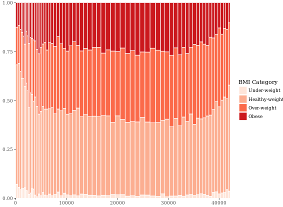
```

```{r eval=FALSE}
# Perform chi.sq test (RBMI and SRAGE_P)
results <- chisq.test(table(adult$RBMI, adult$SRAGE_P))
# Melt results$residuals and store as resid
resid <- melt(results$residuals)
# Change names of resid
names(resid) <- c("FILL", "X", "residual")
# merge the two datasets:
DF_all <- merge(DF_melted, resid)
# Update plot command
library(ggthemes)
ggplot(DF_all, aes(ymin = ymin,
                   ymax = ymax,
                   xmin = xmin,
                   xmax = xmax,
                   fill = residual)) +
  geom_rect() +
  scale_fill_gradient2() +
  scale_x_continuous(expand = c(0,0)) +
  scale_y_continuous(expand = c(0,0)) +
  theme_tufte()
```

```{r echo=FALSE, message=FALSE, out.width="70%", fig.align='center'}
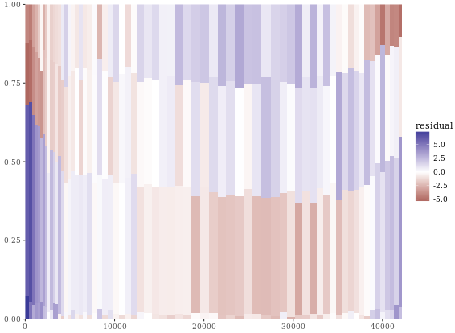
```

Since we're not coloring according to BMI, we have to add group (and x axis) labels manually. The first two commands show how we got the the four positions for the y axis labels. First, we got the position of the maximum xmax values, i.e. at the very right end, stored as index. We want to calculate the half difference between each pair of ymax and ymin (e.g. (ymax - ymin)/2) at these index positions, then add this value to the ymin value. These positions are stored in the variable yposn.

```{r eval=FALSE}
# Position for labels on y axis (don't change)
index <- DF_all$xmax == max(DF_all$xmax)
DF_all$yposn <- DF_all$ymin[index] + (DF_all$ymax[index] - DF_all$ymin[index])/2
# Plot 1: geom_text for BMI (i.e. the fill axis)
p1 <- p %+% DF_all + 
  geom_text(aes(x = max(xmax), 
               y = yposn,
               label = FILL),
            size = 3, hjust = 1,
            show.legend  = FALSE)
p1

# Plot 2: Position for labels on x axis
DF_all$xposn <- DF_all$xmin + (DF_all$xmax - DF_all$xmin)/2
# geom_text for ages (i.e. the x axis)
p1 %+% DF_all + 
  geom_text(aes(x = xposn, label = x),
            y = 1, angle = 90,
            size = 3, hjust = 1,
            show.legend = FALSE)
```

```{r echo=FALSE, message=FALSE, out.width="50%"}
include_graphics(list.files("images/", pattern = "residual", full.names = TRUE))
```

Notice that the function, `mosaicGG()`, takes multiple arguments, such as the data frame of interest and the variables that you want to create the mosaic plot for. None of the arguments have default values, so you'll have to specify all three if you want the mosaicGG() function to work.

```{r eval=FALSE}
# Load all packages
library(ggplot2)
library(reshape2)
library(dplyr)
library(ggthemes)
# BMI described by age (as previously seen)
mosaicGG(adult, X = "SRAGE_P", FILL = "RBMI")
# Poverty described by age
mosaicGG(adult, X = "SRAGE_P", FILL = "POVLL")
# mtcars: am described by cyl
mosaicGG(mtcars, "cyl", "am")
# Vocab: vocabulary described by education
library(carData)
mosaicGG(Vocab, "education", "vocabulary")
```

```{r echo=FALSE, message=FALSE, out.width="50%"}
include_graphics(list.files("images/", pattern = "mosaic", full.names = TRUE))
```

```{r message=FALSE}
# Create movies_small
library(ggplot2movies)# movies data is in this package
library(ggplot2)
library(Hmisc)
set.seed(123)
movies_small <- movies[sample(nrow(movies), 1000), ] # a random sample of 1000 observations from the larger movies dataset
movies_small$rating <- factor(round(movies_small$rating))
# Build a scatter plot with mean and 95% CI
ggplot(movies_small, aes(x = rating, y = votes)) +
  geom_point() +
  stat_summary(fun.data = "mean_cl_normal",  # depicts the mean and the 95% CI
               geom = "crossbar",
               width = 0.2,
               col = "red") +
  scale_y_log10() # transform the y scale
```

```{r eval=FALSE}
ggplot(diamonds, aes(x = carat, y = price, col = color)) +
  geom_point(alpha = 0.5, size = 0.5, shape = 16) +
  scale_x_log10(expression(log[10](Carat)), limits = c(0.1,10)) +
  scale_y_log10(expression(log[10](Price)), limits = c(100,100000)) + # Transform both axes to log10 scales using the aforementioned scale functions
  scale_color_brewer(palette = "YlOrRd") +
  coord_equal() +
  theme_classic()
```

```{r echo=FALSE, message=FALSE, out.width="70%", fig.align='center'}

```

Converse point plot to smooth plot:

```{r eval=FALSE}
# Add smooth layer and facet the plot
ggplot(diamonds, aes(x = carat, y = price, col = color)) +
  stat_smooth(method = "lm") +
  scale_x_log10(expression(log[10](Carat)), limits = c(0.1,10)) +
  scale_y_log10(expression(log[10](Price)), limits = c(100,100000)) +
  scale_color_brewer(palette = "YlOrRd") +
  coord_equal() +
  theme_classic()
```

```{r echo=FALSE, message=FALSE, out.width="70%", fig.align='center'}

```

```{r eval=FALSE}
d <- ggplot(movies_small, aes(x = rating, y = votes)) +
  geom_point() +
  geom_boxplot() +
  stat_summary(fun.data = "mean_cl_normal",
               geom = "crossbar",
               width = 0.2,
               col = "red")
# Untransformed plot
d
# the transformation happens before calculating the statistics
d + scale_y_log10() 
# the transformation happens after calculating the statistics
d + coord_trans(y = "log10")
```

```{r echo=FALSE, message=FALSE, out.width="50%"}
include_graphics(list.files("images/", pattern = "cl_image", full.names = TRUE))
```

If you only have continuous variables, you can convert them into ordinal variables using any of the following functions:

* `cut_interval(x, n)` makes `n` groups from vector `x` with equal range.
* `cut_number(x, n)` makes `n` groups from vector `x` with (approximately) equal numbers of observations.
* `cut_width(x, width)` makes groups of width width from vector `x`.

This is useful when you want to summarize a complex scatter plot like the one shown in the plot1. 

```{r echo=FALSE, message=FALSE, out.width="50%"}
include_graphics(list.files("images/", pattern = "geom_boxplot", full.names = TRUE))
```

# Density Plots
The following default parameters are used (you can specify these arguments both in `density()` as well as `geom_density()`):

* `bw = "nrd0"`, telling R which rule to use to choose an appropriate bandwidth.
* `kernel = "gaussian"`, telling R to use the Gaussian kernel.

You could have a good understanding through [ggplot2 Quick Reference: geom_rug](http://sape.inf.usi.ch/quick-reference/ggplot2/geom_rug).
```{r eval=FALSE}
# Calculating density: d
d <- density(test_data$norm)
# Use which.max() to calculate mode and specify x
mode <- d$x[which.max(d$y)]
# Finish the ggplot call
ggplot(test_data, aes(x = norm)) +
  geom_rug() +
  geom_density() +
  geom_vline(xintercept = mode, col = "red")
```

```{r echo=FALSE, message=FALSE, out.width="70%", fig.align='center'}
include_graphics("images/another14.png")
```

Now that you know how to create a empirical and theoretical density plot, we should compare them in a plot then.

```{r eval=FALSE}
fun_args <- list(mean = mean(test_data$norm), sd = sd(test_data$norm))
ggplot(test_data, aes(x = norm)) +
  geom_histogram(aes(y = ..density..)) +
  geom_density(col = "red") + # empirical
  stat_function(fun = dnorm, args = fun_args, col = "blue") # theoretical
```

```{r echo=FALSE, message=FALSE, out.width="70%", fig.align='center'}
include_graphics("images/another15.png")
```

## Adjusting density plots
There are three parameters that you may be tempted to adjust in a density plot:

* bw - the smoothing bandwidth to be used, see ?density for details
* adjust - adjustment of the bandwidth, see density for details
* kernel - kernel used for density estimation, defined as
  - "g" = gaussian
  - "r" = rectangular
  - "t" = triangular
  - "e" = epanechnikov
  - "b" = biweight
  - "c" = cosine
  - "o" = optcosine

you'll use a dataset containing only four points, `small_data`, so that you can see how these three arguments affect the shape of the density plot.

```{r eval=FALSE}
# Get the default bandwith
get_bw <- density(small_data$x)$bw
# Basic plotting object
p <- ggplot(small_data, aes(x = x)) +
  geom_rug() +
  coord_cartesian(ylim = c(0,0.5))
# Create three plots
p + geom_density()
p + geom_density(adjust = 0.25)
p + geom_density(bw = 0.25 * get_bw)
# Create two plots
p + geom_density(kernel = "r")
p + geom_density(kernel = "e")
```

```{r echo=FALSE, message=FALSE, out.width="50%"}
include_graphics(list.files("images/", pattern = "empirical", full.names = TRUE))
```

A drawback of showing a box plot per group, is that you don't have any indication of the sample size, `n`, in each group, that went into making the plot. One way of dealing with this is to use a variable width for the box, which reflects differences in `n`. Here is an example:

```{r}
ggplot(diamonds, aes(x = cut, y = price, col = color)) +
  geom_boxplot(varwidth = T) +
  facet_grid(. ~ color)
```

```{r eval=FALSE}
# Individual densities
ggplot(mammals[mammals$vore == "Insectivore", ], aes(x = sleep_total, fill = vore)) +
  geom_density(col = NA, alpha = 0.35) +
  scale_x_continuous(limits = c(0, 24)) +
  coord_cartesian(ylim = c(0, 0.3))

# With faceting
ggplot(mammals, aes(x = sleep_total, fill = vore)) +
  geom_density(col = NA, alpha = 0.35) +
  scale_x_continuous(limits = c(0, 24)) +
  coord_cartesian(ylim = c(0, 0.3)) +
  facet_wrap( ~ vore, nrow = 2)

# Note that by default, the x ranges fill the scale
ggplot(mammals, aes(x = sleep_total, fill = vore)) +
  geom_density(col = NA, alpha = 0.35) +
  scale_x_continuous(limits = c(0, 24)) +
  coord_cartesian(ylim = c(0, 0.3))

# Trim each density plot individually
ggplot(mammals, aes(x = sleep_total, fill = vore)) +
  geom_density(col = NA, alpha = 0.35, trim = TRUE) +
  scale_x_continuous(limits=c(0,24)) +
  coord_cartesian(ylim = c(0, 0.3))
```

```{r echo=FALSE, message=FALSE, out.width="50%"}
include_graphics(list.files("images/", pattern = "mammals", full.names = TRUE))
```

```{r eval=FALSE}
# Unweighted density plot from before
ggplot(mammals, aes(x = sleep_total, fill = vore)) +
  geom_density(col = NA, alpha = 0.35) +
  scale_x_continuous(limits = c(0, 24)) +
  coord_cartesian(ylim = c(0, 0.3))

# Unweighted violin plot
ggplot(mammals, aes(x = vore, y = sleep_total, fill = vore)) +
  geom_violin()

# Calculate weighting measure
library(dplyr)
mammals2 <- mammals %>%
  group_by(vore) %>%
  mutate(n = n() / nrow(mammals)) -> mammals

# Weighted density plot
ggplot(mammals2, aes(x = sleep_total, fill = vore)) +
  geom_density(aes(weight = n), col = NA, alpha = 0.35) +
  scale_x_continuous(limits = c(0, 24)) +
  coord_cartesian(ylim = c(0, 0.3))

# Weighted violin plot
ggplot(mammals2, aes(x = vore, y = sleep_total, fill = vore)) +
  geom_violin(aes(weight = n), col = NA)
```

```{r echo=FALSE, message=FALSE, out.width="50%"}
include_graphics(list.files("images/", pattern = "violin", full.names = TRUE))
```

## 2D Density Plots
You can consider two orthogonal density plots in the form of a 2D density plot. Just like with a 1D density plot, you can adjust the bandwidth of both axes independently.

```{r message=FALSE}
# Base layers
library(datasets)
p <- ggplot(faithful, aes(x = waiting, y = eruptions)) +
  scale_y_continuous(limits = c(1, 5.5), expand = c(0, 0)) +
  scale_x_continuous(limits = c(40, 100), expand = c(0, 0)) +
  coord_fixed(60 / 4.5)

# 1 - Use geom_density_2d()
p + geom_density_2d()

# 2 - Use stat_density_2d() with arguments
p + stat_density_2d(aes(col = ..level..), h = c(5, 0.5))
```

Here you'll explore the viridis package. This package contains multi-hue color palettes suitable for continuous variables. The advantage of these scales is that instead of providing an even color gradient for a continuous scale, they highlight the highest values by using an uneven color gradient on purpose. The high values are lighter colors (yellow versus blue), so they stand out more.

```{r}
library(viridis)
# Add viridis color scale
ggplot(faithful, aes(x = waiting, y = eruptions)) +
  scale_y_continuous(limits = c(1, 5.5), expand = c(0,0)) +
  scale_x_continuous(limits = c(40, 100), expand = c(0,0)) +
  coord_fixed(60/4.5) +
  stat_density_2d(geom = "tile", aes(fill = ..density..), h=c(5,.5), contour = FALSE)+
  scale_fill_viridis()
```

# For Large Data
```{r eval=FALSE}
# pairs
pairs(iris[1:4])
# chart.Correlation
library(PerformanceAnalytics)
chart.Correlation(iris[1:4])
# ggpairs
library(GGally)
ggpairs(mtcars_fact[1:3])
```

```{r echo=FALSE, message=FALSE, out.width="50%"}
include_graphics(list.files("images/", pattern = "correlation", full.names = TRUE))
```

```{r eval=FALSE}
library(ggplot2)
library(reshape2)
cor_list <- function(x) {
  L <- M <- cor(x)
  
  M[lower.tri(M, diag = TRUE)] <- NA
  M <- melt(M)
  names(M)[3] <- "points"
  
  L[upper.tri(L, diag = TRUE)] <- NA
  L <- melt(L)
  names(L)[3] <- "labels"
  
  merge(M, L)
}
# Calculate xx with cor_list
library(dplyr)
xx <- iris %>%
  group_by(Species) %>%
  do(cor_list(.[1:4])) 
# Finish the plot
ggplot(xx, aes(x = Var1, y = Var2)) +
  geom_point(aes(col = points, size = abs(points)), shape = 16) +
  geom_text(aes(col = labels,  size = abs(labels), label = round(labels, 2))) +
  scale_size(range = c(0, 6)) +
  scale_color_gradient("r", limits = c(-1, 1)) +
  scale_y_discrete("", limits = rev(levels(xx$Var1))) +
  scale_x_discrete("") +
  guides(size = FALSE) +
  geom_abline(slope = -1, intercept = nlevels(xx$Var1) + 1) +
  coord_fixed() +
  facet_grid(. ~ Species) +
  theme(axis.text.y = element_text(angle = 45, hjust = 1),
        axis.text.x = element_text(angle = 45, hjust = 1),
        strip.background = element_blank())
```

```{r echo=FALSE, message=FALSE, out.width="70%", fig.align='center'}
include_graphics("images/another16.png")
```

## Ternary or Triangle Plot

```{r eval=FALSE}
# Add an ID column from the row.names
africa_sample$ID <- row.names(africa_sample)
# Gather africa_sample
library(tidyr)
africa_sample_tidy <- gather(africa_sample, key, value, -ID)
head(africa_sample_tidy)
# Finish the ggplot command
ggplot(africa_sample_tidy, aes(x = factor(ID), y = value, fill = key)) +
  geom_col() +
  coord_flip()
```

```{r echo=FALSE, message=FALSE, out.width="70%", fig.align='center'}
include_graphics("images/another17.png")
```

```{r eval=FALSE}
# Load ggtern
library(ggtern)

# Build ternary plot
ggtern(africa, aes(x = Sand, y = Silt, z = Clay)) +
  geom_point(shape = 16, alpha = 0.2)
```

```{r echo=FALSE, message=FALSE, out.width="70%", fig.align='center'}
include_graphics("images/another18.png")
```

**Adjust ternary plots**

Ternary plots have been around for a while in R; you could achieve the same thing with the vcd package authored by Michael Friendly. If you just need a quick and dirty ternary plot, that may suit you just fine. However, since ggtern is built on ggplot2, you can take advantage of all the tools available therein.

```{r eval=FALSE}
# Contour plot
ggtern(africa, aes(x = Sand, y = Silt, z = Clay)) +
  geom_density_tern()
# Density olot which i prefer
ggtern(africa, aes(x = Sand, y = Silt, z = Clay)) +
  stat_density_tern(geom = "polygon", aes(fill = ..level.., alpha = ..level..)) +
  guides(fill = FALSE)
```

```{r echo=FALSE, message=FALSE, out.width="50%"}
include_graphics(list.files("images/", pattern = "ternary", full.names = TRUE))
```

# Build the network
# Merge edges and vertices
mmnet <- merge(madmen$edges, madmen$vertices,
               by.x = "Name1", by.y = "label",
               all = TRUE)
# Finish the ggplot command
ggplot(data = mmnet, aes(from_id = Name1, to_id = Name2)) +
  geom_net(aes(col = Gender), size = 6, linewidth = 1, labelon = TRUE, fontsize = 3, labelcolour = "black")

```{r eval=FALSE}
# Merge edges and vertices
mmnet <- merge(madmen$edges, madmen$vertices,
               by.x = "Name1", by.y = "label",
               all = TRUE)

# Finish the ggplot command
ggplot(data = mmnet, aes(from_id = Name1, to_id = Name2)) +
  geom_net(aes(col = Gender), size = 6, linewidth = 1, labelon = TRUE, fontsize = 3, labelcolour = "black")
```

```{r echo=FALSE, message=FALSE, out.width="70%", fig.align='center'}

```

**Adjusting the network**

```{r eval=FALSE}
# Node colors
pink_and_blue <- c(female = "#FF69B4", male = "#0099ff")
# Tweak the network plot
ggplot(data = mmnet, aes(from_id = Name1, to_id = Name2)) +
  geom_net(aes(col = Gender),
           size = 6,
           linewidth = 1,
           labelon = TRUE,
           fontsize = 3,
           labelcolour = "black",
           # Make the graph directed
           directed = TRUE) +
  # Add manual color scale         
  scale_color_manual(values = pink_and_blue) +
  # Set x-axis limits
  xlim(-0.05, 1.05) +
  # Set void theme
  theme_void() # remove all background elements like axes and grid lines to make a clean network plot
```

```{r echo=FALSE, message=FALSE, out.width="70%", fig.align='center'}

```

# Diagnostic Plots
R has several plotting methods for specific objects. For example using `plot()` on the results of an `lm()` call results in four plots that give you insight into how well the assigned model fits the data.

The `ggfortify` package is an all-purpose plot converter between base graphics and ggplot2 grid graphics. For now, just know that if you want to use the automatic output features in the context of `ggplot2`, they must first be converted to a ggplot object via `ggfortify`. This can be important at the superficial level, for consistency in appearance, but also at a deeper level, for later combining several plots in a single graphics device.

```{r eval=FALSE}
# Create linear model: res
res <- lm(Volume ~ Girth, data = trees)
# Plot res
plot(res) # four figures seperated
# Import ggfortify and use autoplot()
library(ggfortify)
library(ggplot2)
autoplot(res, ncol = 2)
```

```{r echo=FALSE, message=FALSE, out.width="50%"}
include_graphics(list.files("images/", pattern = "fitted", full.names = TRUE))
```

**ggfortify - time series
```{r eval=FALSE}
# Call plot() on Canada
plot(Canada)
# Call autoplot() on Canada
autoplot(Canada)
```

```{r echo=FALSE, message=FALSE, out.width="50%"}
include_graphics(list.files("images/", pattern = "canada", full.names = TRUE))
```

```{r eval=FALSE}
# Autoplot + ggplot2 tweaking
autoplot(eurodist) +
  coord_fixed()
# Autoplot of MDS
autoplot(cmdscale(eurodist, eig = TRUE),
         label = TRUE, 
         label.size = 3, 
         size = 0)
```

```{r echo=FALSE, message=FALSE, out.width="50%"}
include_graphics(list.files("images/", pattern = "ggfortify", full.names = TRUE))
```

**Plotting K-means clustering**

```{r eval=FALSE}
# Perform clustering
iris_k <- kmeans(iris[-5], 3)
# Autplot: color according to cluster
autoplot(iris_k, data = iris, frame = TRUE)
# Autoplot: above, plus shape according to species
autoplot(iris_k, data = iris, frame = TRUE, shape = 'Species')
```

```{r echo=FALSE, message=FALSE, out.width="50%"}
include_graphics(list.files("images/", pattern = "cluster", full.names = TRUE))
```


# References
[DataCamp](https://www.datacamp.com/home)

[Tips for working with images](https://www.zevross.com/blog/2017/06/19/tips-and-tricks-for-working-with-images-and-figures-in-r-markdown-documents/)

[R for Data Science](http://r4ds.had.co.nz/tidy-data.html)

 .....