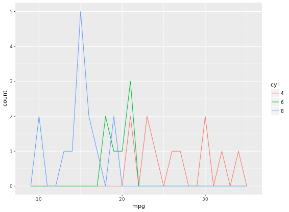
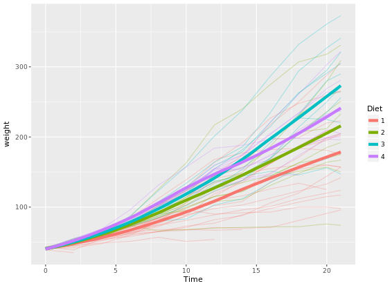
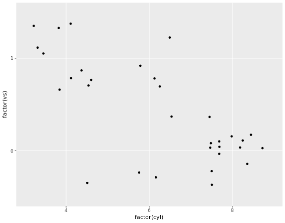
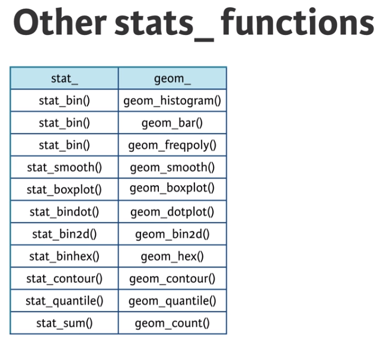
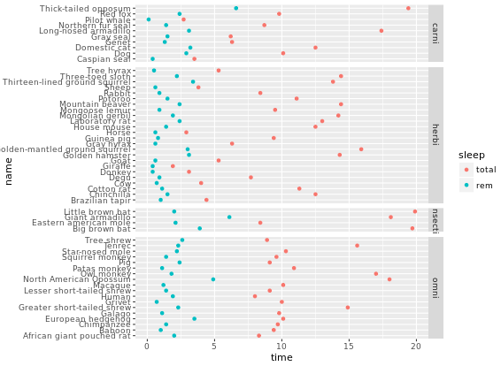

```{r echo=FALSE, message=FALSE, out.width="80%", fig.align='center'}
library(knitr)
include_graphics("images/rstudio.png")
```

----------

# Introduction
R is a language and environment for statistical computing and graphics. R provides a wide variety of statistical (linear and nonlinear modelling, classical statistical tests, time-series analysis, classification, clustering, …) and graphical techniques, and is highly extensible. One of R’s strengths is the ease with which well-designed publication-quality plots can be produced, including mathematical symbols and formulae where needed. The most important thing to me is it is open source and free software. While i prefer R Studio which is open source and enterprise-ready profession software for R. I think it is much more easier to use R Studio than R (You might think so as well). To begin with, there are some basic programming notes you need to remember. Let's get it started!

# Basic programming notes
```{r eval=FALSE}
args(sd) # Useful trick for inspecting the arguments of sd() function in a quick way

Or help(sd) # works well as well

install.packages("package name") # To install a package

library(package name) # To select this package

download.file(url, destfile, ...) # in system package
```

To convert the capital letter to lower case, use function `tolower()`. vise versa, `toupper()` is the opposite. Inspect our workspace with `dir()`. To summarize a vector, use `summary()` to obtain it. To traverse over a set of data like a list or vector, and calling the specified function for each item, use `lapply(X, FUN, ...)`. `FUN` means the function to be applied to each element of x. X is a vector or list or expression object. 

Relational operators
    
    == - Equality
    != - Inequality
    > - Greater than
    < - Less than
    >= - Greater than or equal to
    <= - Less than or equal to
    x %in% c(a, b, c), TRUE if x is in the vector c(a, b, c)
    
Logical operators
  
    & - AND
    | - OR
    ! - NOT

Answering the question which grades in your class are higher than 75? with a vector of logicals is not very insightful. It's much better to ask the question how many grades in your class are higher than 75? instead. You can answer such questions with the sum() function. Each TRUE you passs count as 1, each FALSE as 0. <span style="color:red;"> Just in the same way, you can use mean(); this will give you the proportion of TRUE values in the data structure you pass it. 

**else if statement**
```{r eval=FALSE}
if (condition) {
  expr
} else if (condition) {
  expr
} else {
  expr
}
```

**subsetting from dataset**
```{r eval=FALSE}
subset(x, subset, ...) # subset: logical expression indicating elements or rows to keep
```

**Useful math functions that R features:**
```{r eval=FALSE}
abs() calculate the absolute value.
sum() calculate the sum of all the values in a data structure.
mean() calculate the arithmetic mean.
round() Round the values to 0 decimal places by default. Try out ?round in the console for variations of round() and ways to change the number of digits to round to
```

**Differences between [, [[ and $**
Please refer to [Detailed explanation](https://www.r-bloggers.com/r-accessors-explained/)

****************
# Read flat/excel files
There are several ways to do it. Basically, for "utils" package which is already existed in system library, it is east to read a table using read.table() function as below: 
```{r eval=FALSE}
read.table("states.csv", header = TRUE/FALSE, sep = ",", stringsASFactors = FALSE)

read.csv("states.csv", stringsASFactors = TRUE/FALSE) # To read a csv file
```
Likewise, in the "readr" package, just use functions below:
```{r eval=FALSE}
read_csv(object, col_names = TRUE) # would be enough to import csv files

read_tsv(object) # to load txt files

read_delim(object, delim = "\t", col_names = ...) # function which is the main function of the "readr" package. StringsASFactors do not need to be specified in all three functions as "utils" package required

Extra important arguments: through skip and n_max arguments, you can control which part of your flat file you're actually importing into R. skip specifies the number of lines you're ignoring in the flat file before actually starting to import data. n_max specifies the number of lines you're actually importing.
```

For "data.table" package, function to import data is fread() function which is extremely perfect for lazy people. Despite the different seperators, freed() can easily read csv files without adding sep = ",/." or delim = ",/.".

For "readxl" package, there are two main functions that useed for importing excel sheets into R. 
```{r eval=FALSE}
One is excel_sheets() # to list different sheets

the other one is read_excel() # to actually import data into R. To explain the arguments in detail, see below:

read_excel(path, sheet = 1, col_names = TRUE (by default), col_types = numeric/date/NULL, skip = 0/1/2...) # to specify what excel you wanna import. If you selected Null as col_types, then that column will not be shown in final printout.
```

For "gdata" package, we can utilize 
```{r eval=FALSE}
read.xls(".xls", sheet = 1/2/3... or "sheet name") # to import a xls file into R
```

For "XLConnect" Package, it bridges between Exccel and R. works with xls and xlsx files. Remember to use "lapply" to read all sheets automatically. XLConnect package can make it able to edit excel files from inside R, whose functions are shown below.
```{r eval=FALSE}
loadWorkbook(filename...) # To build a connection between R and xlsx files

createSheet(object, "sheet name") # To create a new sheet in excel files

readWorksheet(object, sheet = 1/2/3..., startCol = 1/2/3..., endCol = 1/2/3...) # To import selected columns to R 

writeWorksheet(object, data, sheet, ...) # load new data into new sheet created

saveWorkbook(object, file) # save the new sheet with a file name
renameSheet(object, sheet, newName) # rename a sheet

removeSheet(object, sheet) # remove sheets
getSheets(object) # to list all sheets in R

For example, lapply(getSheets(loadWorkbook(".xlsx file")), readWorksheet, object = ".xlsx file")
```

****************
# connecting to a database
The first step to import data from a SQL database is creating a connection to it. We might need different packages depending on the database you want to connect to. All of these packages do this in a uniform way, as specified in the "DBI" or "RMySQL" package. If the MySQL database is a remote database hosted on a server, you'll also have to specify the following arguments in dbConnect(): dbname, host, port, user and password. For example,
```{r eval=FALSE}
con <- dbConnect(RMySQL::MySQL(), 
                 dbname = "tweater", 
                 host = "courses.csrrinzqubik.us-east-1.rds.amazonaws.com", 
                 port = 3306,
                 user = "student",
                 password = "datacamp")

* I do not really know what the hell is going on with database connection. Just a note for future use.
```

List and import tables in the database:
```{r eval=FALSE}
dbListTables(DBIConnection object as produced by "dbConnect" function) # list all tables in the database

dbReadTable(object, "column/table name") # to tell R that which data you wanna import

dbDisconnect(object) #  is polite to disconnect the databases after you are done
```

In your life as a data scientist, you'll often be working with huge databases that contain tables with millions of rows. If you want to do some analyses on this data, it's possible that you only need a fraction of this data. In this case, it's a good idea to send SQL queries to your database, and only import the data you actually need into R. dbGetQuery() is what you need. As usual, you first pass the connection object to it. The second argument is an SQL query in the form of a character string. This example selects the age variable from the people dataset where gender equals "male":
```{r eval=FALSE}
dbGetQuery(con, "SELECT age, name FROM people WHERE gender = or > or < 'male' AND ... > ...")
```

****************
### Import data from the web
Pay attention to http:// and https://. There is, however, a safer alternative to HTTP, namely HTTPS, which stands for HypterText Transfer Protocol Secure. Just remember this: HTTPS is relatively safe, HTTP is not. We can use the standard importing functions with https:// connections since R version 3.2.2

you can read excel files on the web using the read_excel package by first downloading the file with the download.file() function. There's more: with download.file() you can download any kind of file from the web, using HTTP and HTTPS: images, executable files, but also .RData files. An RData file is very efficient format to store R data. You can load data from an RData file using the load() function, but this function does not accept a URL string as an argument.
```{r eval=FALSE}
load(file, envir = parent.frame(), verbose = FALSE) # file: a readable connection or a character string giving the name of the file to load; envir: the environment where the data should be loaded; verbose: should item names be printed during loading?
```

Downloading a file from the Internet means sending a GET request and receiving the file you asked for. Internally, all the previously discussed functions use a GET request to download files. "httr" package provides a convenient function, GET() to execute this GET request. The result is a response object, that provides easy access to the status code, content-type and, of course, the actual content. You can extract the content from the request using the content() function. At the time of writing, there are three ways to retrieve this content: as a raw object, as a character vector, or an R object, such as a list. If you don't tell content() how to retrieve the content through the as argument, it'll try its best to figure out which type is most appropriate based on the content-type.
```{r eval=FALSE}
download.file(object, "file name")

GET()

content() 
```

For "jsonlite" package, In the simplest setting, fromJSON() can convert character strings that represent JSON data into a nicely structured R list. Let's take a look at an example,
```{r eval=FALSE}
# wine_json is a JSON
wine_json <- '{"name":"Chateau Migraine", "year":1997, "alcohol_pct":12.4, "color":"red", "awarded":false}'
# Convert wine_json into a list: wine
wine <- fromJSON(wine_json)
# Print structure of wine
str(wine)
```

We can also get a data frame by naming the columns:
```{r eval=FALSE}
json2 <- '{"a": [1, 2, 3], "b": [4, 5, 6]}' # a contains 1, 2, 3; b contains 4, 5, 6
fromJSON(json2)
```

Apart from converting JSON to R with fromJSON(), you can also use toJSON() to convert R data to a JSON format. In its most basic use, you simply pass this function an R object to convert to a JSON. The result is an R object of the class json, which is basically a character string representing that JSON.
```{r eval=FALSE}
toJSON(x, ...) # x is the object to be encoded
```

****************
# Import data from statistical softwares (like SAS, STATA, SPSS) into R
Two packages can be useful to do this. One is "haven", the other is "foreign" package. "haven" can deal with data from SAS, STATA and SPSS. For "haven" package 
```{r eval=FALSE}
read_sas() # to import SAS data

read_dta()
read_stata() # to import STATA data (dta or stata files)

read_spss()
read_por()
read_sav() # to import SPSS data (por or sav files)
```

Subset example:
```{r eval=FALSE}
subset(traits, Extroversion > 40 & Agreeableness > 40) # Use & to stand for "and".
```

You learned how to import a data file using the command read_sav(). With SPSS data files, it can also happen that some of the variables you import have the labelled class. This is done to keep all the labelling information that was originally present in the .sav and .por files. It's advised to coerce (or change) these variables to factors or other standard R classes.
```{r eval=FALSE}
as.factor() # to convert lable as a factor
```

For "foreign" package, it offers a simple function to import and read STATA data: read.dta(). The arguments you will use most often are convert.dates, convert.factors, missing.type and convert.underscore, besides object. It's all about correctly converting STATA data to standard R data structures. Where foreign provided read.dta() to read Stata data, there's also read.spss() to read SPSS data files. To get a data frame, make sure to set to.data.frame = TRUE inside read.spss(). 

****************
# Cleaning and tidying data
Understanding the structure of your data.

First, view its class by class(); Second, view its dimensions by dim(). Third, look at column names by names(). Fourth, to summarize data by summary(). Like str() function, we use the dplyr package to view structure of object as well.
```{r eval=FALSE}
glimpse(object)
```

View the top (top six rows) by head(object, n = ...) function, n means how many rows you wanna show in R. While tail(object, n = ...) is to show the last six rows (by default) you wanna print out. 

****************
## Visualizing your data
```{r eval=FALSE}
hist(object) # to view histogram plot of a single variable

plot(x, y) # to view plot of two variables
```

Principles of tidy data: observations as rows, variables/attributes as columns. Remember that column headers are values, not variable names.

For "tydyr" package, 
```{r eval=FALSE}
gather(data, key, value, -...) # data: a data frame; key: bare name of new key column; value: bare name of new value column or changed column in other words; -...: bare names of columns to not gather or change
mbta4 <- gather(mbta3, "month", "thou_riders", -mode) # example

spread(data, key, value) # is the opposite of gather() function. key: bare name of column containing keys; value: bare name of column containing values

seperate(data, col, into) # data: a data frame; col: bare name of column to seperate; into: character vector of new column names (probably use a c() function to form a vector)

unite(data, col, ..., sep = "...") # is the opposite of seperate() function. data: a data frame; col: bare name of new column; ...: bare names of columns to unite (don't need a c() function, just use comma), sep: seperator used between tow joined columns
```

For more information about `tidyr` package, please refer to [here](https://www.cnblogs.com/nxld/p/6060533.html)

* Removing redundant info
```{r eval=FALSE}
my_df[1:5, ] # First 5 rows of my_df
my_df[, 4]   # Fourth column of my_df

my_df[-(1:5), ] # Omit first 5 rows of my_df
my_df[, -4]     # Omit fourth column of my_df
```

****************
## Type conversions
It is often necessary to change, or coerce, the way that variables in a dataset are stored. This could be because of the way they were read into R (with read.csv(), for example) or perhaps the function you are using to analyze the data requires variables to be coded a certain way. Only certain coercions are allowed, but the rules for what works are generally pretty intuitive. For example, trying to convert a character string to a number gives an error: as.numeric("some text"). There are a few less intuitive results. For example, under the hood, the logical values TRUE and FALSE are coded as 1 and 0, respectively. Therefore, as.logical(1) returns TRUE and as.numeric(TRUE) returns 1.

```{r eval=FALSE}
as.character(...)
as.factor(...)
as.integer(...)
as.numeric(...)
as.logical(...)
```

Dates can be a challenge to work with in any programming language, but thanks to the lubridate package, working with dates in R isn't so bad. Since this course is about cleaning data, we only cover the most basic functions from lubridate to help us standardize the format of dates and times in our data.

As you saw in the video, these functions combine the letters y, m, d, h, m, s, which stand for year, month, day, hour, minute, and second, respectively. The order of the letters in the function should match the order of the date/time you are attempting to read in, although not all combinations are valid. Notice that the functions are "smart" in that they are capable of parsing multiple formats.

    . ymd()
    . ymd_hms()
    . ...just ?ymd or ?ymd_hms, you will find out which function you want.

## String manipulation ("stringr" package)
There are four key functions in stringr for cleaning data:

    -str_trim() - Trim leading and trailing white space
    -str_pad - Pad with additional characters
    -str_detect() - Detect a pattern
    -str_replace() - Find and replace a pattern

One common issue that comes up when cleaning data is the need to remove leading and/or trailing white space. The str_trim() function from stringr makes it easy to do this while leaving intact the part of the string that you actually want.

```{r eval=FALSE}
str_trim("   this is a test     ") # it would print out "this is a test". very easy, huh?
```

A similar issue is when you need to pad strings to make them a certain number of characters wide. One example is if you had a bunch of employee ID numbers, some of which begin with one or more zeros. When reading these data in, you find that the leading zeros have been dropped somewhere along the way (probably because the variable was thought to be numeric and in that case, leading zeros would be unnecessary.)

```{r eval=FALSE}
str_pad("24493", width = 7, side = "left", pad = "0")
[1] "0024493"
```

The stringr package provides two functions that are very useful for finding and/or replacing strings: str_detect() and str_replace(). Like all functions in stringr, the first argument of each is the string of interest. The second argument of each is the pattern of interest. In the case of str_detect(), this is the pattern we are searching for. In the case of str_replace(), this is the pattern we want to replace. Finally, str_replace() has a third argument, which is the string to replace with.

```{r eval=FALSE}
str_detect(string, pattern) # string: input string; pattern: pattern to look for.

str_replace(string, pattern, replacement) # replacement: a character vector of replacements.
```

****************
## Finding and dealing with missing values
As you've seen, missing values in R should be represented by NA, but unfortunately you will not always be so lucky. Before you can deal with missing values, you have to find them in the data. If missing values are properly coded as NA, the is.na() function will help you find them. Otherwise, if your dataset is too big to just look at the whole thing, you may need to try searching for some of the usual suspects like "", "#N/A", etc. You can also use the summary() and table() functions to turn up unexpected values in your data. 

```{r eval=FALSE}
is.na(x) # an R object to be tested.

any(is.na(x)) # to identify whether there is any NA in the dataset.

sum(is.na(x)) # to count number of TRUEs

which(is.na(x)) # to find indices of missing values. very useful to replace data in the dataset
```

Missing values can be a rather complex subject, but here we'll only look at the simple case where you are simply interested in normalizing and/or removing all missing values from your data. For more information on why this is not always the best strategy, search online for "missing not at random."

```{r eval=FALSE}
complete.cases(object, ...) # to see which rows have no missing values

na.omit(object, ...) # to remove all rows with any missing values
```

## Identifying outliers and obvious errors
summary() and hist() are most useful functions to identify outliers. Another useful way of looking at strange values is with boxplots boxplot(). Simply put, boxplots draw a box around the middle 50% of values for a given variable, with a bolded horizontal line drawn at the median. Values that fall far from the bulk of the data points (i.e. outliers) are denoted by open circles. 

There are a number of stylistic conventions in the R language. Depending on who you ask, these conventions may vary. Because the period (.) has special meaning in certain situations, we generally recommend using underscores (_) to separate words in variable names. We also prefer all lowercase letters so that no one has to remember which letters are uppercase or lowercase.

## dplyr package
a **tbl** (pronounced tibble) is just a special kind of data.frame. They make your data easier to look at, but also easier to work with. On top of this, it is straightforward to derive a tbl from a data.frame structure using **tbl_df()**.

Notes: Modifying data with lookup tables. Please refer to [Nice R Code](https://nicercode.github.io/). 

The dplyr package contains five key data manipulation functions, also called verbs:

```{r eval=FALSE}
select(df, var1, var2...) # which returns a subset of the columns,
filter(tbl, logical test) # that is able to return a subset of the rows,
arrange(tbl, column name) # that reorders the rows according to single or multiple variables,
mutate(tbl, new column name = r expression that calculate the new variable) # used to add columns from existing data, not establish a completely new, for example, if you have length, width and height variables, you can add a volume variable in the tbl by length * width * height.
summarise() # which reduces each group to a single row by calculating aggregate measures.
```

Anyhow, dplyr comes with a set of helper functions that can help you select groups of variables inside a select() call:

```{r eval=FALSE}
starts_with("X") # every name that starts with "X",
ends_with("X") # every name that ends with "X",
contains("X") # every name that contains "X",
matches("X") # every name that matches "X", where "X" can be a regular expression,
num_range("x", 1:5) # the variables named x01, x02, x03, x04 and x05,
one_of(x) # every name that appears in x, which should be a character vector.
```

**Pay attention here**: When you refer to columns directly inside select(), you don't use quotes. If you use the helper functions, you do use quotes.

With lapply(), you could use `[[` to select specific elements from your list. The same thing is true for sapply()! Once you know about vapply(), there's really no reason to use sapply() anymore. If the output that lapply() would generate can be simplified to an array, you'll want to use vapply() to do this securely. If simplification is not possible, simply stick to lapply(). 

The droplevels() function removes unused levels of factor variables from your dataset. As you saw in the video, it's often useful to determine which levels are unused (i.e. contain zero values) with the table() function.

load data by data() function in dplyr package. use group_by() function to [group indexes together](https://blog.csdn.net/qq_28219759/article/details/52963773).

## Sampling from dataset
**Simple random sample in R**
```{r eval=FALSE}
# Simple random sample
states_srs <- us_regions %>%
  sample_n(8)

# Count states by region
states_srs %>%
  group_by(region) %>%
  count()
```

**Stratufied sample in R**
```{r eval=FALSE}
# Stratified sample
states_str <- us_regions %>%
  group_by(region) %>%
  sample_n(2)

# Count states by region
states_str %>%
  group_by(region) %>%
  count()
```

**Principles of experimental design**
Control: compare treatment of interest to a control group
Randomize: randomly assign subjects to treatments
Replicate: collect a sufficiently large sample within a study, or replicate the entire study
Block: account for the potential effect of confounding variables
  - group subjects into blocks based on these variables
  - randomize within each block to treatment groups

The difference between numerical and categorical type is show at [here](https://www.zhihu.com/question/41484616?sort=created)

**Conditional proportions**
The following code generates tables of joint and conditional proportions, respectively:
```{r eval=FALSE}
tab <- table(comics$align, comics$gender)
options(scipen = 999, digits = 3) # Print fewer digits
prop.table(tab)     # Joint proportions
prop.table(tab, 2)  # Conditional on columns, make column add to 1
```

*****************
# `ggplot2` Visualization
* Limitations of base plot functions
  - Plot does not get redrawn
  - Plot is drawn as an image
  - Need to manually add legend
  - No unified framework for plotting

* All Grammatical Elements:
  - Data, the dataset being plotted
  - Aesthetics, the scales onto which we map our data
  - Geometries, the visual elements used for our data
  - Facets, plotting small multiples
  - Statistics, representations of our data to aid understanding
  - Coordinates, the space on which the data will be plotted
  - Themes, all non-data ink

* Typical Aesthetics
  - x, X axis position
  - y, y axis position
  - colour, colour of dots, outlines of other shapes
  - fill, fill colour
  - size, diameter of points, thickness of lines
  - alpha, transparency
  - linetype, line dash pattern
  - labels, text on a plot or axes
  - shape, shape

```{r echo=FALSE, message=FALSE, out.width="60%", fig.align='center'}
include_graphics("images/shape.png")
```

```{r echo=FALSE}
read.csv("data/ggplot_aesthetics.csv")
```

```{r eval=FALSE}
ggplot(mtcars, aes(x = cyl, y = mpg, col = disp, size = disp, shape = categorical column, shape = 1, size = 4)) + 
  geom_point(alpha = 0.4, position = "jitter") + # alpha means the transparency of discrete points, 0-1, jitter expands the points more evenly, or you can just use geom_jitter()
  geom_smooth(aes(group = 1), method = "lm", se = FALSE) # if you do not want any error shading, you can set se = FALSE, lm means lineal model method in scatter plot, group = 1 tells ggplot to draw a single linear model through all the points in different colors.
```

Note that you can also call `aes()` within the `geom_point()` function. Which shape to use? The default geom_point() uses shape = 19 (a solid circle with an outline the same colour as the inside). Good alternatives are shape = 1 (hollow) and shape = 16 (solid, no outline). These all use the col aesthetic (don't forget to set alpha for solid points). A really nice alternative is shape = 21 which allows you to use both fill for the inside and col for the outline! This is a great little trick for when you want to map two aesthetics to a dot. 

```{r eval=FALSE}
ggplot(mtcars, aes(x = wt, y = mpg, fill = cyl, col = am, shape = 21, size = 4, label = cyl)) +
  geom_point(alpha = 0.6) +
  geom_text()
```

This time you'll use these arguments to set attributes of the plot, not aesthetics. However, there are some pitfalls you'll have to watch out for: these attributes can overwrite the aesthetics of your plot! **A word about shapes:** In the exercise "All about aesthetics, part 2", you saw that shape = 21 results in a point that has a fill and an outline. Shapes in R can have a value from 1-25. Shapes 1-20 can only accept a color aesthetic, but shapes 21-25 have both a color and a fill aesthetic.
```{r eval=FALSE}
ggplot(mtcars, aes(x=wt, y=mpg, col=cyl)) +
geom_point(col = my_color)
# The col setting in geom_point can overwrite the aesthetics of plot
```

**A word about hexadecimal colours**: Hexadecimal, literally "related to 16", is a base-16 alphanumeric counting system. Individual values come from the ranges 0-9 and A-F. This means there are 256 possible two-digit values (i.e. 00 - FF). Hexadecimal colours use this system to specify a six-digit code for Red, Green and Blue values ("#RRGGBB") of a colour (i.e. Pure blue: "#0000FF", black: "#000000", white: "#FFFFFF"). R can accept hex codes as valid colours.

```{r eval=FALSE}
ggplot(mtcars, aes(x = wt, y = mpg, fill = cyl)) +
geom_text(rownames(mtcars), col = "red")
# Remember specify characters with quotation makrs
```

```{r eval=FALSE}
val = c("#E41A1C", "#377EB8")
lab = c("Manual", "Automatic")
cyl.am +
  geom_bar(position = "dodge") +
  scale_x_discrete("Cylinders") + 
  scale_y_continuous("Number") +
  scale_fill_manual("Transmission", 
                    values = val,
                    labels = lab)
```

**Explaination to the code above:**  `scale_x_discrete()` takes as its only argument the x-axis label: "Cylinders". `scale_y_continuous()` takes as its only argument the y-axis label: "Number". `scale_fill_manual()` fixes the legend. The first argument is the title of the legend: "Transmission". Next, values and labels are set to predefined values for you. These are the colors and the labels in the legend. The result of above code will be like this:

```{r echo=FALSE, message=FALSE, out.width="70%", fig.align='center'}
include_graphics("images/bar1.png")
```

------------------
To make a univariable plot with `ggplot2`, we can set y = o in aesthetics. So far you've focused on scatter plots since they are intuitive, easily understood and very common. A major consideration in any scatter plot is dealing with overplotting. You'll encounter this topic again in the geometries layer, but you can already make some adjustments here.

* You'll have to deal with overplotting when you have:
  - Large datasets,
  - Imprecise data and so points are not clearly separated on your plot (you saw this in the video with the iris dataset),
  - Interval data (i.e. data appears at fixed values), or
  - Aligned data values on a single axis.
  - Large datasets
  - Aligned data values on a single axis

One very common technique that I'd recommend to always use when you have solid shapes it to use alpha blending (i.e. adding transparency). An alternative is to use hollow shapes. These are adjustments to make before even worrying about positioning.

```{r eval=FALSE}
ggplot(mtcars, aes(x = wt, y = mpg, col = cyl)) +
geom_point(size = 4, shape = 1, alpha = 0.6)
# shape = 1 will change points to hollow points which is good, alpha can improve the overplotting
```

The plot will be like:

```{r echo=FALSE, message=FALSE, out.width="70%", fig.align='center'}
include_graphics("images/overplotting.png")
```

**37 Geometries in ggplot2**

* abline (scatter plot)
* area
* bar (bar plot)
* bin2d
* blank
* boxplot
* contour
* crossbar
* density
* density2d
* dotplot
* errorbar (bar plot)
* errorbarh
* freqpoly
* hex
* histogram (bar plot)
* hline
* jitter (scatter plot)
* line  (line plot)
* linerange
* map
* path
* point (scatter plot)
  - Essential: x, y
  - Optional: alpha, colour, fill, shape, size
* pointrange
* polygon
* quantile
* raster
* rect
* ribbon
* rug
* segment
* smooth
* step
* text
* tile
* violin
* vline

```{r eval=FALSE}
# 1 - Define posn_d with position_dodge()
posn_d <- position_dodge(width = 0.2)
# 2 - Use posn_d as position and adjust alpha to 0.6
ggplot(mtcars, aes(x = cyl, fill = am)) +
  geom_bar(position = posn_d, alpha = 0.6)
```

Result would be like:

```{r echo=FALSE, message=FALSE, out.width="70%", fig.align='center'}
include_graphics("images/bar2.png")
```

```{r eval=FALSE}
ggplot(mtcars, aes(mpg, col = cyl)) +
  geom_freqpoly(binwidth = 1, position = "identity")
```

```{r echo=FALSE, message=FALSE, out.width="70%", fig.align='center'}

```

```{r eval=FALSE}
# Add the recess periods
ggplot(economics, aes(x = date, y = unemploy/pop)) +
  geom_rect(data = recess,
         aes(xmin = begin, xmax = end, ymin = -Inf, ymax = +Inf),
         inherit.aes = FALSE, fill = "red", alpha = 0.2) +
  geom_line()
```

```{r echo=FALSE, message=FALSE, out.width="70%", fig.align='center'}
include_graphics("images/line1.png")
```

```{r eval=FALSE}
# Make it easy to read
ggplot(ChickWeight, aes(x = Time, y = weight, col = Diet)) +
  geom_line(aes(group = Chick), alpha = 0.3) +
  geom_smooth(lwd = 2, se = FALSE)
```

```{r echo=FALSE, message=FALSE, out.width="70%", fig.align='center'}

```

While `qplot()` can do some easy plots like that:
```{r eval=FALSE}
# qplot() with geom set to jitter manually
qplot(factor(cyl), factor(vs), data = mtcars, geom = "jitter")
```

```{r echo=FALSE, message=FALSE, out.width="70%", fig.align='center'}

```

```{r eval=FALSE}
# "True" dot plot, with geom_dotplot():
ggplot(mtcars, aes(cyl, wt, fill = am)) +
  geom_dotplot(binaxis = "y", stackdir = "center")
```

```{r echo=FALSE, message=FALSE, out.width="70%", fig.align='center'}
include_graphics("images/dotplot1.png")
```

```{r eval=FALSE}
# add facet_grid() layer
ggplot(titanic, aes(x = Pclass, fill = Sex)) +
  geom_bar(position = "dodge") +
  facet_grid(. ~ Survived)
# Define an object for position jitterdodge, to use below
posn.jd <- position_jitterdodge(0.5, 0, 0.6)
# but use the position object defined above
ggplot(titanic, aes(x = Pclass, y = Age, color = Sex)) +
  geom_point(size = 3, alpha = 0.5, position = posn.jd) +
  facet_grid(. ~ Survived)
```

Two figures are compared: 

```{r echo=FALSE, message=FALSE, out.width="50%"}
include_graphics(list.files("images/", pattern = "jitter", full.names = TRUE))
```

# Advanced plotting with `ggplot2`

```{r echo=FALSE, message=FALSE, out.width="70%", fig.align='center'}

```

```{r eval=FALSE}
ggplot(mtcars, aes(x = wt, y = mpg, col = factor(cyl))) +
  geom_point() +
  stat_smooth(method = "lm", se = FALSE)

# 2 - Plot 1, plus another stat_smooth() containing a nested aes()
ggplot(mtcars, aes(x = wt, y = mpg, col = factor(cyl))) +
  geom_point() +
  stat_smooth(method = "lm", se = FALSE) +
  stat_smooth(method = "lm", se = FALSE, aes(group = 1))
```

```{r echo=FALSE, message=FALSE, out.width="50%"}
include_graphics(list.files("images/", pattern = "smooth", full.names = TRUE))
```

In the previous exercise we used `se = FALSE` in `stat_smooth()` to remove the 95% Confidence Interval. Here we'll consider another argument, `span`, used in LOESS smoothing, and we'll take a look at a nice scenario of properly mapping different models.
```{r eval=FALSE}
ggplot(mtcars, aes(x = wt, y = mpg, col = factor(cyl))) +
  geom_point() +
  stat_smooth(method = "lm", se = FALSE) +
  stat_smooth(method = "loess", aes(group = 1),
              se = FALSE, col = "black", span = 0.7)

# Set col to "All", inside the aes layer of stat_smooth()
ggplot(mtcars, aes(x = wt, y = mpg, col = factor(cyl))) +
  geom_point() +
  stat_smooth(method = "lm", se = FALSE) +
  stat_smooth(method = "loess",
              # Add col inside aes()
              aes(group = 1, col = "All"),
              # Remove the col argument below
              se = FALSE, span = 0.7)

# Add scale_color_manual to change the colors
myColors <- c(brewer.pal(3, "Dark2"), "black")
ggplot(mtcars, aes(x = wt, y = mpg, col = factor(cyl))) +
  geom_point() +
  stat_smooth(method = "lm", se = FALSE, span = 0.7) +
  stat_smooth(method = "loess", 
              aes(group = 1, col="All"), 
              se = FALSE, span = 0.7) +
  scale_color_manual("Cylinders", values = myColors)
```

```{r echo=FALSE, message=FALSE, out.width="50%"}
include_graphics(list.files("images/", pattern = "multi", full.names = TRUE))
```

Focus on the color because `scale_color_brewer` on default have a maximum 9 for palette Blues.
```{r eval=FALSE}
ggplot(Vocab, aes(x = education, y = vocabulary, col = factor(year))) +
  stat_smooth(method = "lm", se = FALSE) +  # smooth
  scale_color_brewer()  # colors

# Plot 5: Add the group aes, specify alpha and size
ggplot(Vocab, aes(x = education, y = vocabulary, col = year, group = factor(year))) +
  stat_smooth(method = "lm", se = FALSE, alpha = 2, size = 2) +
  scale_color_gradientn(colors = brewer.pal(9, "YlOrRd"))
```

```{r echo=FALSE, message=FALSE, out.width="50%"}
include_graphics(list.files("images/", pattern = "color", full.names = TRUE))
```

Another useful stat function is `stat_sum()`. This function calculates the total number of overlapping observations and is another good alternative to overplotting.
```{r eval=FALSE}
# Jittering only
p <- ggplot(Vocab, aes(x = education, y = vocabulary)) +
  geom_jitter(alpha = 0.2)
# Add stat_sum will map overall count of each dot onto size
p +
  stat_sum()
# Set size range of the dots
p +
  stat_sum() + 
  scale_size(range = c(1, 10))
```

```{r echo=FALSE, message=FALSE, out.width="50%"}
include_graphics(list.files("images/", pattern = "stat_sum", full.names = TRUE))
```

```{r eval=FALSE}
library(ggplot2)
library(Hmisc)
wt.cyl.am <- ggplot(mtcars, aes(x = cyl,  y = wt, col = am, fill = am, group = am))
posn.d <- position_dodge(width = 0.1)
posn.jd <- position_jitterdodge(jitter.width = 0.1, dodge.width = 0.2)
posn.j <- position_jitter(width = 0.2)
# Plot 1: Jittered, dodged scatter plot with transparent points
wt.cyl.am +
  geom_point(position = posn.jd, alpha = 0.6)

# Plot 2: Mean and SD - the easy way
wt.cyl.am +
  geom_point(position = posn.jd, alpha = 0.6) +
  stat_summary(fun.data = mean_sdl, fun.args = list(mult = 1), position = posn.d)

# Plot 3: Mean and 95% CI - the easy way
wt.cyl.am +
  geom_point(position = posn.jd, alpha = 0.6) +
  stat_summary(fun.data = mean_cl_normal, position = posn.d)

# Plot 4: Mean and SD - with T-tipped error bars - fill in ___
wt.cyl.am +
  stat_summary(geom = "point", fun.y = mean,
               position = posn.d) +
  stat_summary(geom = "errorbar", fun.data = mean_sdl,
               position = posn.d, fun.args = list(mult = 1), width = 0.1)
```

```{r echo=FALSE, message=FALSE, out.width="50%"}
include_graphics(list.files("images/", pattern = "summary", full.names = TRUE))
```

```{r eval=FALSE}
# Add three stat_summary calls to wt.cyl.am
wt.cyl.am +
  stat_summary(geom = "linerange", fun.data = med_IQR,
               position = posn.d, size = 3) +
  stat_summary(geom = "linerange", fun.data = gg_range,
               position = posn.d, size = 3,
               alpha = 0.4) +
  stat_summary(geom = "point", fun.y = median,
               position = posn.d, size = 3,
               col = "black", shape = "X")
```

```{r echo=FALSE, message=FALSE, out.width="70%", fig.align='center'}
include_graphics("images/another.png")
```

```{r eval=FALSE}
p <- ggplot(mtcars, aes(x = wt, y = hp, col = am)) + geom_point() + geom_smooth()
# limits to set the aesthetic limit, expand is to ensure the data is placed some distance away from axes
p + scale_x_continuous(limits = c(3, 6), expand = c(0, 0))
# Add coord_cartesian(): the proper way to zoom in
p + coord_cartesian(xlim = c(3, 6))
```

```{r echo=FALSE, message=FALSE, out.width="50%"}
include_graphics(list.files("images/", pattern = "point", full.names = TRUE))
```

```{r eval=FALSE}
# Complete basic scatter plot function
base.plot <- ggplot(iris, aes(x = Sepal.Length, y = Sepal.Width, col = Species)) +
               geom_jitter() +
               geom_smooth(method = "lm", se = FALSE)
base.plot
# Fix aspect ratio (1:1) of base.plot
base.plot + coord_equal(ratio = 1)
base.plot + coord_equal(ratio = 2)
base.plot + coord_equal(ratio = 3)
```

```{r echo=FALSE, message=FALSE, out.width="50%"}
include_graphics(list.files("images/", pattern = "scale", full.names = TRUE))
```

```{r eval=FALSE}
wide.bar <- ggplot(mtcars, aes(x = 1, fill = cyl)) +
              geom_bar()
# Convert wide.bar to pie chart
wide.bar +
  coord_polar(theta = "y")
# Create stacked bar plot: thin.bar
thin.bar <- ggplot(mtcars, aes(x = 1, fill = cyl)) +
              geom_bar(width = 0.1) +
              scale_x_continuous(limits = c(0.5, 1.5))
# Convert thin.bar to "ring" type pie chart
thin.bar + 
  coord_polar(theta = "y")
```

```{r echo=FALSE, message=FALSE, out.width="50%"}
include_graphics(list.files("images/", pattern = "ring", full.names = TRUE))
```

```{r eval=FALSE}
# Basic scatter plot
p <- ggplot(mtcars, aes(x = wt, y = mpg)) +
  geom_point()
p +
  facet_grid(am ~ .)
# 2 - Separate columns according to column cylinders, cyl
p +
  facet_grid(. ~ cyl)
# 3 - Separate by both columns and rows 
p +
  facet_grid(am ~ cyl)
```

```{r echo=FALSE, message=FALSE, out.width="50%"}
include_graphics(list.files("images/", pattern = "facet_grid", full.names = TRUE))
```

**For many variables**
```{r eval=FALSE}
# Code to create the cyl_am col and myCol vector
mtcars$cyl_am <- paste(mtcars$cyl, mtcars$am, sep = "_")
myCol <- rbind(brewer.pal(9, "Blues")[c(3,6,8)],
               brewer.pal(9, "Reds")[c(3,6,8)])
ggplot(mtcars, aes(x = wt, y = mpg, col = cyl_am, size = disp)) +
  geom_point() +
  scale_color_manual(values = myCol) +
  facet_grid(gear ~ vs)
```

```{r echo=FALSE, message=FALSE, out.width="70%", fig.align='center'}
include_graphics("images/another1.png")
```

```{r eval=FALSE}
# Facet rows accoding to vore which is pretty hard to read, right?
p +
  facet_grid(vore ~ .)
# Specify scale and space arguments to free up rows
p +
  facet_grid(vore ~ ., scale = "free_y", space = "free_y")
```

```{r echo=FALSE, message=FALSE, out.width="70%", fig.align='center'}
include_graphics("images/free_y1.png")
```

```{r echo=FALSE, message=FALSE, out.width="70%", fig.align='center'}

```


