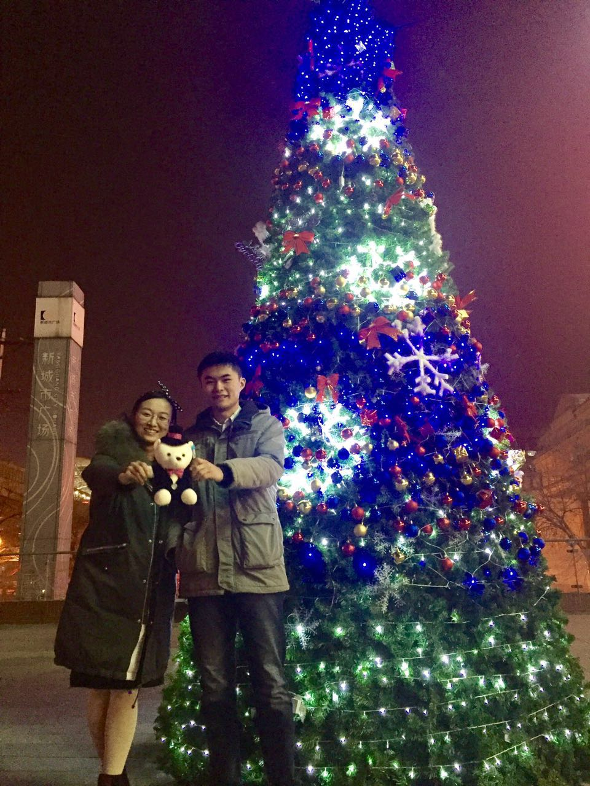
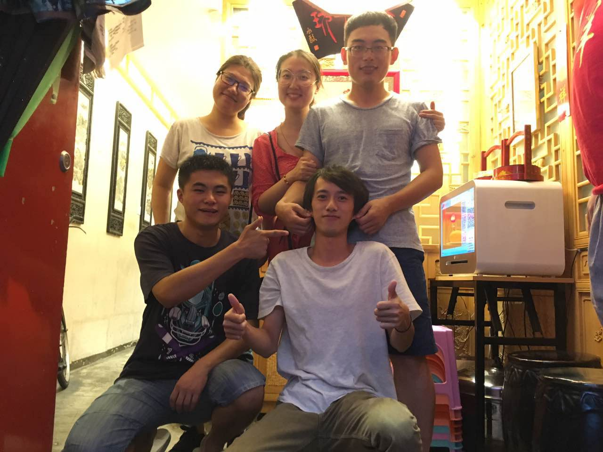
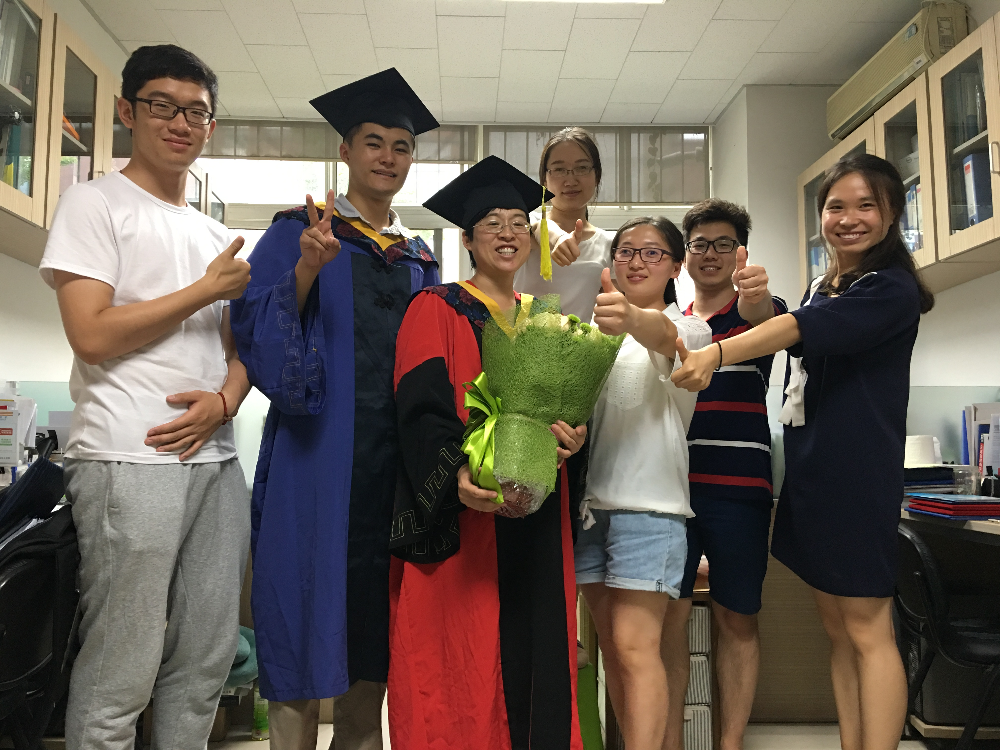
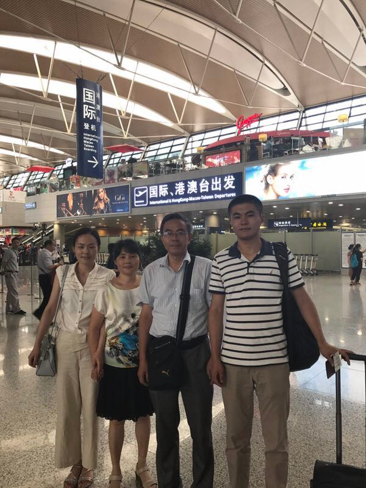

```{r echo=FALSE, message=FALSE, out.width = "40%", fig.align='center'}
library(knitr)

```

----------

<div style="float: left; position: relative">
</div>

<div style="float: left; position: relative">
</div>

<div style="float: right; position: relative">
</div>

<div class = "col-md-8">

# Chew the fat
This is not all about research though. Some stories to show the support from my family, Yanhua and all people care about me. Thank you all.

